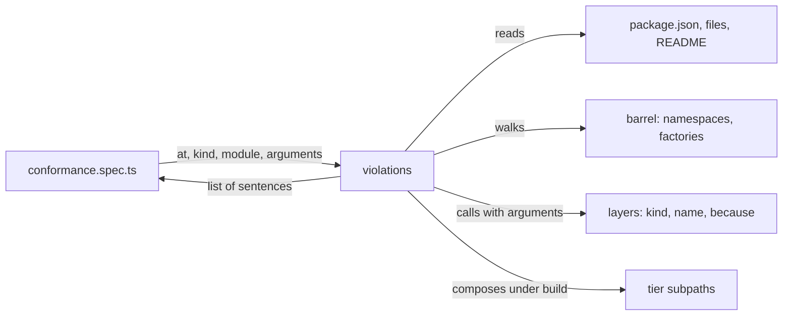

# RFC-0002: A conformance suite for config and plugin packages

## Summary

We propose a kit, `@stealthscale/testing-config`. It reads a configuration package or a plugin
package and returns a list of the parts of the house contract that the package breaks. This is the
same shape `@stealthscale/testing-react` has for a component. The contract covers what the manifest
publishes, what the module exports, and what the layers are called and carry. Each package adds one
specification that asserts an empty list. A package that drifts from the contract fails its own gate
with a sentence that names what drifted.

## Motivation

### The problem

On 2026-09-16 the gate passed with 832 tests, full coverage, and clean attw and publint runs on
every package. The same tree contained these defects:

- Two published packages had no licence text in their tarballs.
- Three READMEs had block tables that listed exports that did not exist, or omitted exports that
  did.
- One composed tier had layer names in three grammars.
- One docblock said coverage was off, above the line that turned it on.
- One plain configuration was copied into three files.

Each defect is a promise a package makes to the repositories that install it. No unit specification
reaches any of them.

### Why now

This repository becomes the one monorepo for every stealthscale package. The number of packages that
make this promise grows from nine to every package in the company. Review checks a contract once. A
specification checks it on every run of every package, and the failure message names the package and
the promise.

### Why this layer

The check belongs in a kit, not in a linter, a script or the release workflow:

- A linter sees one file. It cannot compose a tier or read a tarball's file list.
- A script at the root runs under the root's environment, which is node. The layers of a rendering
  package need a document to compose.
- The release workflow is the last place to learn that a README is wrong.
- A kit is imported by the package's own specification, runs under the package's own configuration,
  and returns a list that a specification asserts on. Every other kit in this repository already has
  that shape.

## Detailed design

### One specification per package

Each package adds one specification beside its barrel:

```ts
// packages/vite-config-react/src/conformance.spec.ts
import { join } from "node:path";
import { describe, expect, it } from "vitest";

import { violations } from "@stealthscale/testing-config";

describe("@stealthscale/vite-config-react", () => {
  it("keeps the config package contract", async () => {
    await expect(
      violations({
        at: join(import.meta.dirname, ".."),
        kind: "config",
        module: await import("#index.ts"),
      }),
    ).resolves.toStrictEqual([]);
  });
});
```

- A plugin package writes the same with `kind: "plugin"`.
- A kit such as `testing` writes it with `kind: "library"`. That kind checks the manifest and
  nothing else.
- A factory that cannot be called without arguments is given them:

```ts
await violations({
  at: join(import.meta.dirname, ".."),
  arguments: {
    "lint.relax": [{ because: "a reason", files: ["src/**"], rules: {} }],
    "server.port": [4200],
  },
  kind: "config",
  module: await import("#index.ts"),
});
```

A factory with required parameters and no entry in `arguments` is reported as a violation. Nothing
is skipped without a report.

### The kit's exports

```ts
// packages/testing-config/src/index.ts
export { type Check, type Conformance, violations } from "#conformance.ts";
export { type Found, isLayer, type Layer, type LayerKind, layersOf } from "#layers.ts";
export { type Kind, type Published, publishedOf } from "#manifest.ts";
export { type Arguments, type Factory, prefixOf, type Walked, walked } from "#module.ts";
export { type Tiers } from "#tier.ts";
```

```ts
/**
 * One check the suite runs, named for what it reads and what it asks.
 */
export type Check =
  | "layer.kind"
  | "layer.named"
  | "layer.reasoned"
  | "layer.unique"
  | "manifest.engines"
  | "manifest.exports"
  | "manifest.files"
  | "manifest.peers"
  | "module.factories"
  | "plugin.named"
  | "plugin.peer"
  | "readme.exports"
  | "tier.composes";

/**
 * The package under test, and what the suite cannot work out on its own.
 */
export interface Conformance {
  /**
   * The arguments a factory needs, keyed by the path a consumer writes: `lint.relax`,
   * `server.port`. A factory with required parameters and no entry here is a violation.
   */
  arguments?: Readonly<Record<string, readonly unknown[]>> | undefined;

  /**
   * The package's directory, as an absolute path.
   */
  at: string;

  /**
   * The kind of package. A config package is checked on all three parts of the contract. A plugin
   * package is checked on its manifest and its one factory. A library is checked on its manifest
   * alone.
   */
  kind: "config" | "library" | "plugin";

  /**
   * The package's barrel, as `await import("#index.ts")`.
   */
  module: Readonly<Record<string, unknown>>;

  /**
   * The checks to run and no others. For narrowing a failure, never for a committed
   * specification.
   */
  only?: readonly Check[] | undefined;

  /**
   * The checks to leave out, each with a reason a reviewer can weigh.
   */
  skip?: Readonly<Partial<Record<Check, string>>> | undefined;

  /**
   * The tier modules a config package publishes, keyed by subpath: `preset/app`. Every tier
   * subpath in the manifest has to be here, so a tier added without an edit to the specification
   * is reported.
   */
  tiers?: Readonly<Record<string, Readonly<Record<string, unknown>>>> | undefined;
}

/**
 * Finds every part of the contract a package breaks.
 *
 * Each violation is one sentence that names the export, the file or the layer, and what was
 * expected of it. The list is empty for a package that conforms.
 *
 * @param stated - The package under test. `Conformance` documents every member.
 * @returns Each violation, in the order the checks run.
 */
export function violations(stated: Conformance): Promise<readonly string[]>;
```

A reviewer reads a skipped check the way they read a `because` on a layer, because `skip` is a
record of reasons keyed by check and the reason is on the same line as the check it turns off.

### The manifest checks

These checks read `package.json`, the `files` field and the directory. They run for every kind.

| Check              | Reads                                               | Reports                                                                                                                                                                                         |
| ------------------ | --------------------------------------------------- | ----------------------------------------------------------------------------------------------------------------------------------------------------------------------------------------------- |
| `manifest.exports` | `exports`, `publishConfig.exports`, `src/`, `dist/` | A subpath whose `stealth-source` names no file under `src/`. A subpath with no `default`. A subpath present in one map and absent from the other. A `default` that does not point into `dist/`. |
| `manifest.files`   | `files`, the directory                              | `dist`, `LICENSE` or `README.md` missing from `files`. An entry in `files` that is absent from the directory.                                                                                   |
| `manifest.engines` | `engines.node`, the root manifest                   | A node floor that differs from the root's.                                                                                                                                                      |
| `manifest.peers`   | `peerDependencies`, `dependencies`                  | A peer that is also a dependency. A `vite` or `vite-plus` peer not taken from the peer catalog. A config package that peers on `vite`. A plugin package that peers on `vite-plus`.              |

The last check reads the raw manifest, where the catalog protocol is still visible. That is why the
kit reads the file and does not import the manifest. attw and publint already check that each
published subpath resolves and that the map is well formed. The suite does not repeat those checks.

### The module checks

These checks run for a config package. The kit walks the barrel:

- Every export that is an object of functions is a namespace.
- Every function on a namespace is a factory.
- Every function exported directly is a factory in the top-level namespace.

| Check              | Reports                                                                                                                            |
| ------------------ | ---------------------------------------------------------------------------------------------------------------------------------- |
| `module.factories` | An export that is neither a function nor a namespace of functions. A factory with required parameters and no entry in `arguments`. |
| `readme.exports`   | A namespace named in the README's block table that the barrel does not export. An exported namespace that the table does not name. |

`readme.exports` reads the first Markdown table under a heading that contains the word `Blocks`. It
takes the first column of that table as the namespace names. A package without such a table passes
the check. The check is about drift between a table and a barrel, not about having a table.

### The layer checks

Each factory is called with its `arguments` entry, or with no arguments. The return value is
flattened into a list of layers.

| Check            | Reports                                                                                                                                                                                                               |
| ---------------- | --------------------------------------------------------------------------------------------------------------------------------------------------------------------------------------------------------------------- |
| `layer.kind`     | A factory that throws. A value shaped like a layer that is not one. A list that mixes layers with other values. A helper that returns a string or a record is not a layer and passes.                                 |
| `layer.named`    | A layer whose name is not the path a consumer writes to call its factory. A layer in a list whose name is outside the factory's block. A name with a `/` prefix.                                                      |
| `layer.reasoned` | A contribution, removal or override whose `because` is empty. A preset that carries a `because`.                                                                                                                      |
| `layer.unique`   | Two layers with one name and one kind from one factory, or inside one tier's composition. A removal and the contribution that replaces it share a name on purpose.                                                    |
| `tier.composes`  | A tier subpath in the manifest with no entry in `tiers`. A tier without `layers()` or `defineConfig`. A `defineConfig` that returns something other than a function of the environment, or that throws under a build. |

`tier.composes` reads the tier subpaths from the manifest's export map and calls each supplied
`defineConfig` the way the toolchain does, with a build environment. The tier modules are supplied
through `tiers`, because a specification imports its own package by subpath and the kit cannot. A
package that adds a tier without adding it to `tiers` is reported.

A top-level function other than `layers` and `workspace` is called only when `arguments` has an
entry for it. The kernel's minting functions re-exported from a barrel have none and are left alone.
A departure such as `css.warn` has one and is checked like a factory in a block.

### The plugin checks

These checks run for a plugin package.

| Check          | Reports                                                                                                                                                        |
| -------------- | -------------------------------------------------------------------------------------------------------------------------------------------------------------- |
| `plugin.named` | A barrel with no function that returns a plugin. A plugin whose `name` does not start with `stealth:`. A plugin without `configResolved` and `generateBundle`. |
| `plugin.peer`  | The same conditions as `manifest.peers`. It is a separate check so that a plugin's specification can skip the manifest half with a reason.                     |

### The violation messages

```
exports["./preset/app"] names src/preset/app.ts under stealth-source, which does not exist
files omits LICENSE
module.factories: lint.relax has required parameters and no entry in arguments
layer.named: lint.rendered returns lint.relax(**/*.spec.tsx, **/*.fixtures.tsx), which is not named for the call
layer.reasoned: react.plugin.refresh is a contribution with an empty because
readme.exports: README names a block layout that the barrel does not export
tier.composes: preset/web composes twice a layer named test.environment(happy-dom)
```

Each sentence names the thing and the expectation. A failure is fixed without opening the kit.



### The kit's place in the workspace

- The kit is `packages/testing-config`, a node-tier package.
- At run time it depends on nothing under `packages/`. It reads a layer through its own structural
  type, `{ kind, name, because? }`, and does not import the kernel.
- The kit is a development dependency of the workspace root. A package's specification resolves it
  through the root, so no package depends on the kit and no cycle exists.
- The manifest writers that build a scratch tree live in `@stealthscale/testing`. The kit's own
  specifications import them. The kit itself reads the real tree and never writes one.

### Checks left to other tools and to review

- Behaviour. A layer's own specification checks what the layer sets.
- Docblocks and README text. Review checks whether they say what the code does. The README table is
  the exception, because a table is data.
- Anything that attw and publint already report.

## Alternatives considered

### A `describeConformance` that writes the test cases

MUI's `describeConformance(element, () => options)` runs a fixed suite of test cases from one call.
Its `skip` and `only` options select among named checks such as `componentProp`, `refForwarding` and
`themeDefaultProps`. The equivalent here would be a function that calls `describe` and `it` itself.

**Why not:**

- The kits in this repository assert nothing. A specification is one assertion, and a failure names
  the breach.
- `testing-react` returns a list of violations for that reason, and this kit takes the same shape.
- MUI's `skip` and `only` are kept, with a reason attached to each skip.

### Lint rules for package authors

`eslint-plugin-eslint-plugin` lints the code of an ESLint plugin. It checks that rule metadata is
present, that message ids are used, and that tests have the expected shape. The equivalent here
would be a set of Oxlint plugin rules that check a factory names its layer after itself and takes a
record with `because` first.

**Why not:**

- A rule sees one file. It cannot compose a tier to find two layers with one name, read a tarball's
  file list, or compare a README to a barrel.
- A rule can check the shape of one factory's argument. Such a rule can be added without changing
  this proposal.

### One specification at the root that scans `packages/*`

Add a root-level project, listed beside the packages, that reads every package and runs every check
in one place. No package has to add a specification.

**Why not:**

- The root runs its tests under the node environment. Composing a rendering package's layers needs
  that package's own configuration. So does a factory that resolves a setup file through its own
  package name.
- A package's `arguments` table belongs beside the package, where the person who adds a factory
  edits it.

### Extend attw and publint

Both already run on every pack, and both read the manifest.

**Why not:**

- Neither knows the `stealth-source` condition, the `files` convention or the peer catalog.
- Neither reads a module's exports beyond their resolvability.
- The suite leaves to them what they check and adds the rest.

### Type-level checks

Declare the shape of a barrel as a type and hold each barrel to it with `satisfies`.

**Why not:**

- A type can require that `layers()` exists and returns a list.
- A type cannot require that a layer's name equals the path a consumer wrote, or that a `because` is
  not an empty string. Those two checks find the drift that exists today.

## Drawbacks

- One new package, with a manifest, a README, a plain configuration of the node tier and its own
  specifications. It is packed on every bootstrap.
- Eleven new specification files, one per package under `packages/`, including the two plugins and
  the two kits.
- An `arguments` table in the specification of `vite-config` with 36 entries, one for each factory
  with a required parameter. The table has to be edited when a factory's signature changes.
- `readme.exports` parses Markdown. A README that changes the heading or the table shape passes the
  check while checking nothing. The check reports a missing table only when a heading with `Blocks`
  exists and no table follows it.
- A committed specification that passes `only` checks less than it appears to. The suite reports
  `only` as a violation of its own when `CI` is set, which is one more environment read in the tree.
- The layer checks enforce the grammar proposed for the config packages. This kit cannot be released
  before those packages are renamed, and its checks change when the grammar does.

## Answered questions

1. The kit is named `testing-config`. The other kits are named for what their specifications read,
   and a plugin package and a library manifest are both configuration a consumer installs.
2. `readme.exports` stays. Three README tables disagreed with their barrels on the day the kit was
   written, and a table is data.
3. A factory with a default for every parameter is called once with no arguments. A specification
   that wants a second call with other arguments supplies them, and the suite calls the factory with
   those instead.

## Open questions

1. Should the examples under `examples/` run the layer checks on their composed configs, given that
   they are private and never published?

## Unresolved and future work

- An Oxlint plugin rule for the shape of a departure's argument record is not proposed here.
- Checking that every layer named in a README exists is not proposed here. Only namespaces are
  checked.
- Running the suite against a packed tarball instead of the tree is not proposed here.

## References

| What                                                     | Where                                                                                                         |
| -------------------------------------------------------- | ------------------------------------------------------------------------------------------------------------- |
| MUI `describeConformance`, options and named checks      | `packages/mui-material/test/describeConformance.js` in mui/material-ui, and its use in `Autocomplete.test.js` |
| `eslint-plugin-eslint-plugin`, linting plugin code       | https://github.com/eslint-community/eslint-plugin-eslint-plugin                                               |
| publint, what a manifest promises a package manager      | https://publint.dev                                                                                           |
| Are the types wrong, how types resolve per module system | https://arethetypeswrong.github.io                                                                            |
| The drift found in this tree on 2026-09-16               | the build review of that date: two tarballs without licence text, three README tables, three name grammars    |
