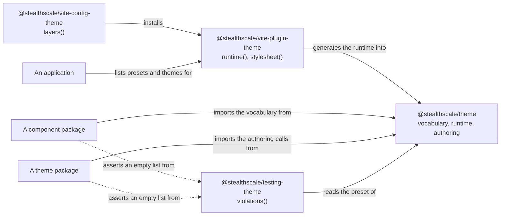
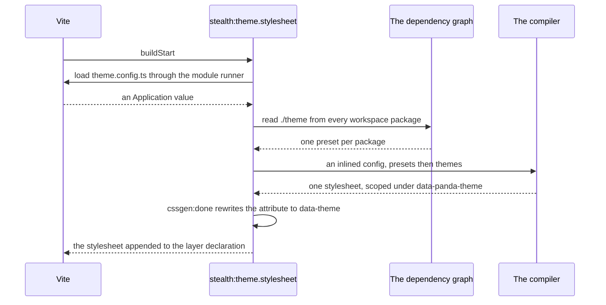

# RFC-0003: Theming: the vocabulary, recipes, themes and scopes

## Summary

We propose a design system in four packages:

- `@stealthscale/theme` publishes the vocabulary a recipe is written against, generates the styling
  runtime a component binds through, and publishes the calls a theme is written with.
- `@stealthscale/vite-plugin-theme` generates that runtime. It also compiles one stylesheet for an
  application from every preset and theme on its dependency graph.
- `@stealthscale/vite-config-theme` installs both as layers.
- `@stealthscale/testing-theme` returns the parts of the theme contract a theme, a recipe or a
  preset breaks, and measures every text and boundary pair against a contrast table.

A component states how it is drawn in one recipe and nowhere else. A theme states values and recipe
extensions and never names a component. An application lists the themes a page can wear, and the
first of them is the default.

## Motivation

### The requirements

The component libraries, the providers and the platform SDK move into this repository from their own
repositories. Every one of them draws an interface, and this repository publishes seventeen packages
with no design system for them to draw against. A component written against the wrong constraint is
rewritten once per component, so the vocabulary has to exist before they arrive rather than after.

We set four requirements:

- A component styles itself through its recipe and through nothing else.
- A repository defines any number of themes. Each theme draws in a light mode and a dark mode.
- Every value a component draws with is configurable by a theme. That covers geometry, motion and
  typography, not colour alone.
- A theme that breaks the contract, or that draws an ink too close to its background, does not ship.

### Why this layer

The vocabulary belongs in a foundation package and a build plugin rather than in each component
package. Three constraints put it there:

- A recipe file is imported by the component that draws with it, so everything the recipe file
  imports reaches the browser bundle. The vocabulary has to be data and the compiler has to stay at
  build time.
- One stylesheet for an application requires something that walks the dependency graph. A component
  package cannot see its siblings.
- A contract is worth stating only if something measures it. Every other contract in this repository
  is held by a kit that returns a list of violations, which a package asserts is empty.

### Prior art

We read four systems before drafting. Each supplied evidence for a choice recorded here.

| System                  | What we read                                                                       | What it showed                                                                                                                                                                                                                                    |
| ----------------------- | ---------------------------------------------------------------------------------- | ------------------------------------------------------------------------------------------------------------------------------------------------------------------------------------------------------------------------------------------------- |
| Panda CSS 2.0.0-beta.17 | `llms-full.txt`, `@pandacss/types`, and the native binary                          | The theme attribute is written into the binary three times. No option renames it                                                                                                                                                                  |
| The platform repository | The foundation, the components and the compiled stylesheet of the docs application | A pattern read as a runtime value put 86 KB of `@pandacss/preset-base` into a browser bundle. The built theme compiled only under `:where(:root,:host)`, so no attribute selected it. Eight contrast pairs measured below the thresholds set here |
| Chakra v3               | `packages/react/src/theme/*` at `main`                                             | The `bg`, `fg` and `border` families with status members, the `fill` and `outline` layer styles, and the placement-aware motion styles                                                                                                            |
| Radix Colors            | The twelve-step scale and the documented use of each step                          | Twelve roles named for their use rather than their step                                                                                                                                                                                           |

## Detailed design

### The four packages



### Recipes and bindings

A recipe is a value. `defineRecipe` types it against the vocabulary and names each compound.

```ts
import {
  controlSizes,
  defineRecipe,
  interactive,
  lookVariants,
} from "@stealthscale/theme/authoring";

export const recipe = defineRecipe({
  className: "button",
  jsx: [/Button$/u],
  base: { ...interactive(), alignItems: "center", display: "inline-flex" },
  variants: {
    size: controlSizes(["xs", "sm", "md", "lg", "xl"]),
    variant: lookVariants(["solid", "subtle", "outline", "ghost", "surface", "plain"]),
  },
  defaultVariants: { size: "md", variant: "solid" },
});
```

The two definition calls keep the literal values of each variant, which is what types a component's
props:

```ts
export function defineRecipe<const Variants extends RecipeVariantRecord>(
  recipe: Recipe<Variants>,
): Recipe<Variants>;

export function defineSlotRecipe<
  const Slots extends string,
  const Variants extends SlotRecipeVariantRecord<Slots>,
>(recipe: SlotRecipe<Slots, Variants>): SlotRecipe<Slots, Variants>;
```

The binding reads the generated runtime and returns the components that draw the recipe. It stamps
`data-recipe` on the element that carries the variants, and a slot attribute on each part, which is
how the testing kit finds a rendered component without knowing its markup:

```ts
export function createRecipeContext<const Variants extends RecipeVariantRecord>(
  recipe: Recipe<Variants>,
): RecipeBinding<Variants>;

export function createSlotRecipeContext<
  const Slots extends string,
  const Variants extends SlotRecipeVariantRecord<Slots>,
>(recipe: SlotRecipe<Slots, Variants>): SlotRecipeBinding<Slots, Variants>;
```

A recipe reads semantic tokens, layer styles, text styles, animation styles and scale steps. It
names no colour, no length in `px`, `rem` or `pt`, and no colour mode. The kit reports each of
those.

### The vocabulary

We define three tiers, after the W3C Design Tokens format. Reference tokens state values. Semantic
tokens state uses. A recipe reads uses.

Reference tokens cover eleven OKLCH hue ramps with alpha scales, a four-pixel grid shared between
spacing and sizes, a typographic ratio, radii, border widths, durations, easings, z-index steps,
blurs, opacities, cursors and aspect ratios. `@pandacss/preset-panda` is not installed. It clashes
with this vocabulary on six categories and on the text styles, and every category it supplies is
written here as data.

Semantic colour is three families and a palette of twelve roles. Each role is named for its use
rather than for its step:

| Role                     | Use                                 |
| ------------------------ | ----------------------------------- |
| `bg`, `subtle`, `muted`  | A tinted section, a badge, an input |
| `emphasized`             | The hovered or selected fill        |
| `border`, `border.hover` | The element's boundary              |
| `solid`, `solid.hover`   | The solid fill                      |
| `fg`, `fg.muted`         | Text in the palette                 |
| `contrast`               | Text on `solid`                     |
| `focusRing`              | The focus indicator                 |

Eight semantic palettes fill those roles by reference, so a recipe names an intent and a theme
decides the hue. `paletteAlias` writes all twelve references from one hue, which makes a remap one
line:

```ts
import { paletteAlias, palettes } from "@stealthscale/theme/authoring";

export const semanticTokens = {
  colors: { ...palettes({ accent: "cyan", primary: "teal", secondary: "indigo" }) },
};
```

Patterns are typed functions from props to a style object, never runtime values. This is the
constraint that keeps the compiler out of the browser bundle.

### The two axes

A page sets the theme and the colour mode independently, each through an attribute. The attribute is
written on the document root for a whole page, or on any element for a subtree:

```ts
export const THEME_ATTRIBUTE = "data-theme";
export const COLOR_MODE_ATTRIBUTE = "data-color-mode";
```

The compiler writes `data-panda-theme` rather than either of these. The plugin registers a
`cssgen:done` host hook, which is the compiler's documented seam for editing its output, and
rewrites the attribute in the compiled stylesheet. A specification asserts that the compiler's name
is absent from the output.

Each theme compiles under its own attribute, and the first theme in the list also compiles unscoped
as the default. A subtree can therefore wear any theme, the default included:

```ts
export interface Application {
  /** The presets the application writes for recipes of its own. */
  presets?: readonly Preset[] | undefined;
  /** The recipes to compile outright, for a page that picks variants while it runs. */
  static?: "*" | StaticCssOptions | undefined;
  /** The themes the page can wear. The first is the default. */
  themes: readonly [Theme, ...Theme[]];
}
```

The colour mode conditions follow the operating system preference where a page states no attribute,
and the attribute where it does. The preference half is anchored to the document root. The compiler
replaces the nesting selector with a theme's own selector, and the default theme has no selector, so
without that anchor the preference half compiles to a bare negation that matches every element.

### Compiling the stylesheet

An application states its themes in `theme.config.ts`, which imports theme packages and the
application's own presets. Those are TypeScript modules in a pnpm workspace. The compiler loads its
own configuration in its own process, and it resolves neither the workspace links nor the
TypeScript.

The plugin loads the statement through Vite's module runner and inlines the result into the
configuration it hands the compiler.



The two plugins are `stealth:theme.runtime` and `stealth:theme.stylesheet`:

```ts
export function runtime(options: RuntimeOptions = {}): Plugin;
export function stylesheet(options: Options = {}): Plugin;
```

Neither emits at bundle time. Both record their root when the configuration resolves.

### The accessibility gate

The kit measures every pair in both modes against two thresholds:

```ts
export const THRESHOLDS: Thresholds = { boundary: 3, focus: 3, text: 7 };
```

The thresholds are WCAG 2.2 success criterion 1.4.6 for text, which is level AAA, and 1.4.11 for a
boundary or a focus indicator, which is level AA and has no AAA level. `fg.subtle` is held to the
boundary ratio and is refused as a text colour by the recipe check, which is why it is the one ink
with a lower threshold.

The three entry points each return a list a specification asserts is empty:

```ts
export function violations(theme: Theme, options?: ThemeChecks): readonly string[];
export function recipeViolations(recipe: Declared, options?: RecipeChecks): readonly string[];
export function presetViolations(preset: Preset, options: PresetChecks): readonly string[];
```

### A theme package and a component package

A theme states its values in files named for the category and one extension per recipe in a file
named for the recipe. `index.ts` lists them by hand. A component package writes its preset by hand
in the same way. Neither file is generated. The gate reads the recipe files as text and reports one
the list leaves out, which gives the guarantee that generation would give without running a plugin
in a component package.

```ts
export function defineTheme(config: ThemeConfig): Theme;
export function definePreset(preset: PresetConfig): Preset;
```

A derived theme states `extends` and only the files it changes. `defineTheme` links the parent
through `preset.presets`, which is the compiler's own composition mechanism. Each level's extensions
therefore compile under the derived theme's name, and a theme two levels down needs no special
handling in the plugin.

## Alternatives considered

### Style components with `css()` and style props

Let a component call `css()` or take style props, as Chakra and the compiler's own documentation
show. Authors get a familiar interface and a one-off style costs one line.

**Why not:** a style prop needs the compiler in the browser to interpret it. A `css()` call in a
component is a style no theme can reach. Both defeat the first requirement.

### Generate the runtime in every package that draws

Run the runtime generator in each component package, which is the setup the compiler documents.

**Why not:** every copy is generated from the same preset, so a bundle drawing from two component
packages carries two identical runtimes. It also puts the class separator, the condition list and
the naming scheme in as many places as there are packages, with nothing holding them equal.

### Keep the compiler's theme attribute

Ship `data-panda-theme` and document it. No hook, no rewrite, no specification.

**Why not:** the attribute is written by a provider this repository publishes and read by pages
outside it, which makes the compiler a published interface. The compiler is at beta. The rewrite
costs one host hook and one assertion.

### Rewrite export maps so the compiler can load a theme

Publish each theme with an export map that the compiler's own configuration loader resolves.

**Why not:** it constrains every theme package's manifest for one consumer, and it does not help a
theme that is a workspace package resolved through a link.

### Hold a theme to the contract in review

Document the contract and the contrast table, and check them when reading a pull request.

**Why not:** the system we read enforced it this way. Eight of its own pairs measured below the
thresholds, and review had passed all of them.

## Drawbacks

- **Four packages.** This repository publishes seventeen, and four of them are this design. One
  wraps a compiler at beta, pinned at `2.0.0-beta.17` across four catalog entries.
- **Every drawing package depends on the foundation.** `@stealthscale/theme` bounds the version of
  every package that draws, and its generated directory has to exist before a consuming package
  type-checks.
- **A one-off style costs a token.** A component that needs a value no token carries adds the token
  to the foundation. That is a change to a package 92 source files long, reviewed by someone other
  than the component author.
- **No command-line compile.** The theme statement is loaded through Vite, so the compiler cannot be
  run against an application's configuration without the plugin.
- **AAA for text rules out hues.** The 7:1 threshold rejects ramp steps that read well to the eye. A
  theme author meets the gate rather than their own judgement.
- **A theme is six files before it draws anything.** The smallest theme in this repository has six
  files under `src/`, and each extension a theme adds is another.
- **The foundation and the plugin depend on each other** for a first green run. The plugin's
  specifications use a scratch workspace with a stub system package to break the cycle.

## Answered questions

- **Does the compiler let us rename its theme attribute?** No. The name is in the native binary. The
  `cssgen:done` hook edits the output instead.
- **Can a recipe file be imported in a browser?** Yes, once the patterns are functions and the
  vocabulary is data. We measured 86 KB removed from the bundle.
- **Where does the colour mode live?** On `data-color-mode`, not on a class, so it composes with the
  theme attribute on one element or on either side of it.
- **Is a component package's preset generated?** No. It is hand-written, and the gate reports a
  recipe file the list leaves out.

## Open questions

- Should a theme be allowed to lower a threshold for a non-text surface, or is the table fixed?
- What defines a component token tier for a theme that wants one?
- Which hue ramps, if any, cannot meet 7:1 at the step the twelve roles assign them?

## Unresolved and future work

- A component token tier is not proposed here. A theme that wants one defines it itself.
- The class-name scheme that the compiled stylesheet and the generated runtime are rewritten into is
  not proposed here.
- Porting the component libraries, the providers and the platform SDK into this repository is not
  proposed here. They are the first consumers of the constraints recorded here.

## References

| What                                                                    | Where                                                    |
| ----------------------------------------------------------------------- | -------------------------------------------------------- |
| WCAG 2.2, success criteria 1.4.6 and 1.4.11                             | https://www.w3.org/TR/WCAG22/                            |
| Design Tokens Format Module, the three-tier structure                   | https://tr.designtokens.org/format/                      |
| Chakra v3 theme sources, read at `main`                                 | `packages/react/src/theme/*`                             |
| Park UI preset sources, read at `main`                                  | `packages/preset/src/*`                                  |
| Radix Colors, the twelve-step scale and the use of each step            | https://www.radix-ui.com/colors                          |
| Panda CSS 2.0.0-beta.17, `llms-full.txt`, `@pandacss/types`, the binary | The installed packages and `compiler.linux-x64-gnu.node` |
| The compiled stylesheet we measured, 211,015 bytes                      | `platform/apps/docs/dist/assets/index-CuugC16g.css`      |
