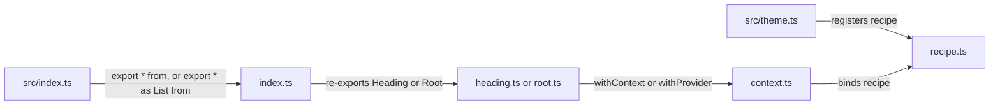

# RFC-0004: The form of a component: its files, its element, its axes and its specifications

## Summary

We propose one form for every component package under `components/`. A component is a directory
named after it, holding a recipe, a binding, one file per element it draws, and a barrel, with a
specification beside every one of those files. A caller changes the element a component draws
through the `as` prop the compiler's factory supports, and a package binds Ark only where it binds
one of Ark's machines. A component with parts is published as a namespace, `List.Root`, through its
directory's barrel. A bound element carries `data-recipe` and no other attribute of ours. Every axis
the vocabulary lets a theme move on a component is an axis of its recipe. The typography package
takes this form first, and the testing kits gain the three checks the form needs.

## Motivation

### The requirements

This repository publishes fifteen component packages, and none of them holds a component yet. The
foundation publishes the vocabulary a recipe is written against and the two bindings a component
draws through, and it decides nothing about the files a component is written in, the element a
caller gets, or the props a component offers. Written one at a time without a form, each component
takes the shape its author found least resistant that day, and a library of a hundred components
ends up with as many forms as it had authors.

We set four requirements:

- Every component in every package is written in the same files, so that a reader who has read one
  directory has read them all.
- A caller changes the element a component draws without the component knowing, because a heading's
  level and a list's numbering are the caller's to decide.
- Every value a theme can move on a component is reachable as a prop, because a style prop is
  forbidden and a component with no axis for its size has no size a caller can pick.
- Every source file has a specification beside it, the barrels included.

### Why this layer

The form belongs in the component packages and the testing kits, not in the foundation. The
foundation already publishes `createRecipeContext` and `createSlotRecipeContext`, and the compiler
generates the factory they wrap. Nothing in this proposal adds a runtime. What it adds is a rule for
how a package uses what exists, three checks that hold a package to the rule, and one rewrite of the
generated runtime, in the file the plugin already rewrites.

### Prior art

We read two factories. The compiler's own, generated at
`foundations/theme/generated/jsx/factory.mjs`, reads an `as` prop. Ark's, at `@ark-ui/react@5.39.2`,
wraps an element in 56 lines to add an `asChild` prop that clones the one child and merges the props
into it. This proposal binds through the first and reserves the second for the packages that bind
Ark's machines.

## Detailed design

### The directory

One layout for every component. A component that draws one element has one component file. A
component that draws several parts has one file per part. Nothing else differs.

```
components/<package>/src/<name>/
  index.ts              what the directory publishes; the package barrel reads this file alone
  index.spec.ts
  recipe.ts             export const recipe = defineRecipe(...) or defineSlotRecipe(...)
  recipe.spec.ts
  context.ts            export const { PropsProvider, withContext } = createRecipeContext(recipe)
  context.spec.ts
  <name>.ts             the component, where the component draws one element
  <name>.spec.tsx
  <part>.ts             one file per part, where the component draws several
  <part>.spec.tsx
```

A file is named for what it exports. `recipe.ts` exports `recipe`. `context.ts` exports the binding.
`heading.ts` exports `Heading`. `root.ts` exports `Root`. The directory carries the component's
name, so the name is written once, on the directory, and on no file in it. A file is `.ts` unless it
holds JSX, and then it is `.tsx`. A binding holds none, so `heading.ts` and `root.ts` are `.ts`. A
component that composes elements in JSX, as one that marks matches in a run of text does, is `.tsx`.
A specification that renders is `.spec.tsx`.



The package barrel reads each directory's `index.ts` and nothing deeper. An element component is
published flat and a component with parts is published as a namespace:

```ts
// components/typography/src/index.ts
export * from "#heading/index.ts";
export * as List from "#list/index.ts";
```

A consumer writes `<Heading>` and `<List.Root>`. The directory's barrel re-exports each part under
the name its file gave it:

```ts
// components/typography/src/list/index.ts
export { Indicator, type IndicatorProps } from "#list/indicator.ts";
export { Item, type ItemProps } from "#list/item.ts";
export { Root, type RootProps } from "#list/root.ts";
```

The namespace is the one name a component with parts has. The card example proves the form against
the compiler's extraction, with `jsx: [/^Card(\.\w+)?$/u]` on its recipe.

`button/icon-button.ts` binds the button's recipe a second time, with the square shape as a default
prop and a props type that requires an accessible name. It has no recipe and no context of its own,
because a theme that moves the button is meant to move the square with it, and it is named for what
it exports, as every file is. A directory holds one recipe and binds it as often as it has
components.

### The element

The compiler's generated factory reads two props of its own off every styled component:

```ts
// foundations/theme/generated/types/jsx.d.mts, at 2.0.0-beta.17
export interface AsProps {
  as?: ElementType | undefined;
}

export interface UnstyledProps {
  unstyled?: boolean | undefined;
}
```

`as` swaps the element and keeps the recipe. `<Heading as="h1">` draws an `h1` in the heading's
recipe. `as` takes a component as well as a tag, so `<Button as={Link} to="/x">` draws a router link
as a button. `unstyled` drops the recipe's classes and keeps the caller's.

A component binds a tag through the foundation's binding, whose options are the factory's:

```ts
// foundations/theme/src/context.ts
export interface RecipeBinding<Variants extends RecipeVariantRecord> {
  PropsProvider: Provider<DataAttrs & Partial<RecipeSelection<Variants>>>;
  usePropsContext: () => RecipeSelection<Variants> | undefined;
  withContext: <Tag extends ElementType>(
    Component: Tag,
    options?: JsxFactoryOptions<ComponentProps<Tag>>,
  ) => StyledComponent<Tag, RecipeSelection<Variants>>;
}

// foundations/theme/generated/types/jsx.d.mts
export interface JsxFactoryOptions<TProps extends AnyProps> {
  dataAttr?: boolean;
  defaultProps?: Partial<TProps> & DataAttrs;
  shouldForwardProp?: (prop: string, variantKeys: string[]) => boolean;
  forwardProps?: string[];
}
```

The tag a component binds is the element the browser gives the meaning to. A heading is `h2`, a
paragraph `p`, a key `kbd`, code `code`, an icon `svg`, a list `ul`. A default the element needs is
a `defaultProps` entry, `type: "button"` on a button and `role: "list"` on a list, and the docblock
states why.

```ts
// components/typography/src/heading/heading.ts
export const Heading = withContext("h2");
export type HeadingProps = ComponentProps<typeof Heading>;

// components/typography/src/list/root.ts
export const Root = withProvider("ul", "root", { defaultProps: { role: "list" } });
export type RootProps = ComponentProps<typeof Root>;
```

The factory does not support `asChild`. This proposal binds Ark's factory in no package that binds
no machine. The case `asChild` exists for is a machine part wrapping a component of ours,
`<Dialog.Trigger asChild><Button /></Dialog.Trigger>`, and Ark's parts carry `asChild` themselves,
so the trigger honours it without the button knowing. The one case `as` does not cover is merging
into an element the caller already built. A caller with that case writes the element with `as` and
hands the props to it.

`unstyled` is a prop the factory reads and this proposal does not offer. A consumer who drops a
recipe is a consumer no theme reaches.

`PropsProvider` is published only where a consumer sets variants from above, under the component's
name, `ButtonPropsProvider`. A heading publishes none.

### A part that is another component

A part may bind one of the library's own components rather than a tag. The blockquote's icon part
binds `Icon`:

```ts
// components/typography/src/blockquote/icon.ts
import { Icon as Artwork } from "#icon/icon.ts";

export const Icon = withContext(Artwork, "icon");
```

The factory composes the two recipes. `<Blockquote.Icon size="lg">` takes the icon's size axis, and
the blockquote's icon slot adds its colour. The blockquote recipe sizes nothing on the icon slot.
That is the rule for a part that is another component: the part's own recipe styles what the part
is, and the slot styles the part's place in the whole. The icon's `jsx` pattern, `/Icon$/u`, matches
`Blockquote.Icon`, so the compiler extracts the size a caller picks there too.

### The attributes

The factory writes `data-recipe` on the element that takes the variants when the binding passes
`dataAttr: true`, which the foundation's `createRecipeContext` does. For a component with parts, the
foundation stamps `data-recipe` on the part that takes the variants, and the compiler's slot binding
writes `data-slot` on every part, at two places in `create-slot-recipe-context.mjs`.

Only the testing kit reads either attribute. No stylesheet rule selects on them and no runtime code
reads them. The example application's page carries 24 `data-recipe` and 16 `data-slot` attributes in
a 10.4 kB body.

`data-slot` repeats the slot class. Every part carries `list__item`, which names the recipe and the
slot, and the pruning drops variant classes and leaves that one. This proposal drops the attribute
in the runtime rewrite:

```ts
// packages/pandacss-compiler/src/runtime.ts
interface Edit {
  anchor: RegExp;
  line: string;
  replacement: string;
  /**
   * How many times the anchor is found where the rewrite needs it. One unless stated.
   */
  times?: number | undefined;
}

const SLOTS: Rewrite = {
  edits: [
    { anchor: /'data-slot': slot,\n\s*/gu, line: "'data-slot': slot,", replacement: "", times: 2 },
  ],
  file: join("jsx", "create-slot-recipe-context"),
  names: [],
};
```

`applied` throws today when an anchor is found any number of times but one. It takes the count off
the edit instead. A rewrite with no names writes no import header, and marks its file done with a
comment on its first line.

`data-recipe` stays. For a component with parts it marks which part carries the variants, and the
classes do not say that. The part is whichever slot the author bound with `withProvider`, `root` in
a list and `root` in a blockquote.

### The recipe and its axes

Every component has a recipe, including one whose base is `{}`. The recipe is the key a theme
extends the component by. `Text` states no base style and still has `className: "text"`.

An axis takes its values from a helper where one exists. Looks come from `lookVariants`, sizes of a
control from `controlSizes`, sizes of an icon from `iconSizes`, statuses from `statusVariants`. A
helper writes roles, so a theme that moves the role moves every component reading it. A value the
helpers do not cover is written as a role by hand.

Every component offers, as an axis, each thing the vocabulary lets a theme move on it. The
vocabulary is the foundation's: the text style roles `display`, `heading`, `label`, `body`, `code`
and `caption`, the foreground roles `fg`, `fg.muted`, `fg.subtle`, `fg.inverted` and one per status,
the layer styles under `fill`, `outline` and `text`, the animation styles, the semantic `gap`,
`inset`, `control` and `icon` scales, the font weights and the letter spacings. The seven typography
components take these axes:

| Component    | Axis       | Values                                                | From                                |
| ------------ | ---------- | ----------------------------------------------------- | ----------------------------------- |
| `Text`       | `size`     | `sm`, `md`, `lg`                                      | `body.*` roles                      |
|              | `tone`     | `default`, `muted`, `inverted`, and the four statuses | `fg.*` roles                        |
|              | `weight`   | `normal`, `medium`, `semibold`, `bold`                | font weight tokens                  |
|              | `align`    | `start`, `center`, `end`, `justify`                   | keyword                             |
|              | `truncate` | boolean                                               | keyword                             |
|              | `motion`   | `fade`, `rise`, `reveal`                              | animation styles                    |
|              | `mask`     | `bottom`                                              | `mask.*` layer styles               |
| `Heading`    | `size`     | `sm`, `md`, `lg`, `xl`, `2xl`                         | `heading.*` roles                   |
|              | `tone`     | as `Text`                                             | `fg.*` roles                        |
|              | `effect`   | `gradient`, `shine`                                   | `text.*` layer styles, `shimmer`    |
|              | `motion`   | `fade`, `rise`, `reveal`                              | animation styles                    |
|              | `truncate` | boolean                                               | keyword                             |
| `Code`       | `variant`  | `solid`, `subtle`, `surface`, `outline`, `plain`      | `lookVariants`                      |
|              | `size`     | `sm`, `md`                                            | `code.*` roles, `inset.*`           |
|              | `status`   | the four statuses                                     | `statusVariants`                    |
| `Kbd`        | `variant`  | `raised`, `outline`, `subtle`, `plain`                | tokens by hand, `lookVariants`      |
|              | `size`     | `sm`, `md`, `lg`                                      | `label.*` roles, `control.*`        |
|              | `status`   | the four statuses                                     | `statusVariants`                    |
| `Icon`       | `size`     | `inherit`, `xs`, `sm`, `md`, `lg`, `xl`               | `iconSizes`                         |
|              | `tone`     | `current`, `muted`, and the four statuses             | `fg.*` roles                        |
|              | `motion`   | `spin`, `float`, `twinkle`                            | animation styles                    |
|              | `mirrored` | boolean                                               | `_rtl` condition                    |
| `List`       | `variant`  | `marker`, `plain`                                     | keyword, `_marker` condition        |
|              | `align`    | `start`, `center`, `end`                              | keyword                             |
|              | `gap`      | `xs`, `sm`, `md`, `lg`, `xl`                          | `gap.*` scale                       |
|              | `motion`   | `rise`, `reveal`                                      | animation styles                    |
| `Blockquote` | `variant`  | `subtle`, `solid`, `plain`, `glass`                   | tokens by hand, `glass` layer style |
|              | `justify`  | `start`, `center`, `end`                              | keyword                             |
|              | `size`     | `sm`, `md`, `lg`                                      | `body.*` roles, `gap.*`, `inset.*`  |
|              | `status`   | the four statuses                                     | `statusVariants`                    |
|              | `motion`   | `rise`, `reveal`                                      | animation styles                    |

A heading's size axis names the heading roles and not the steps of the type scale. A heading states
how loud it is. Which level it is stays with the element, where a screen reader reads it. An icon
that flips in a right-to-left page is an axis of the icon, `mirrored`, rather than a component of
its own.

Three rules hold for every recipe. `jsx` lists every tag that carries the variants, as a pattern on
the name's end, `/Heading$/u` and `/^List(\.\w+)?$/u`, so a wrapper a consumer names `PageHeading`
is extracted without the package knowing it. A compound is named, and the compiler emits its styles
under `heading--<name>`. A recipe writes no nested selector for a child element and no state of a
sibling. An icon inside a button is the icon component's business.

### The specifications

Every source file has a specification beside it, the barrels included. The cases per file:

- `index.spec.ts`: names every export and nothing beside it, as a sorted list, and publishes neither
  the recipe nor the binding.
- `recipe.spec.ts`: writes no value a theme cannot move, through `recipeViolations`. Names its
  class. Offers the axes it offers, through `axesOf`. Draws the defaults when nothing is asked for,
  through `defaultsOf`. Offers each axis's values, through `valuesOf`. Tracks every tag whose name
  ends in the component's.
- `context.spec.ts`: draws the recipe's class on an element it binds, and hands a provider's
  variants to an element below it where the binding returns a provider.
- `<name>.spec.tsx` and `<part>.spec.tsx`: keeps the component contract, through `violations`,
  inside the root where the part needs one above it. Draws the recipe's class and the classes of the
  default variants. Draws the class of each value a caller picks, and no class for a value that does
  not style the part. Draws the element `as` names. Takes the variants a provider sets, where the
  component publishes one.

The package keeps `conformance.spec.ts` for the library contract, `theme.spec.ts` for the preset,
and `index.spec.ts` naming every export of the package barrel.

### The kit changes

The conformance kit gains an `as` check:

```ts
// packages/testing-react/src/conformance.tsx
export interface ConformanceOptions {
  /**
   * Whether to check that the component renders the element `as` names in place of its own.
   */
  as?: boolean | undefined;
  asChild?: boolean | undefined;
  children?: boolean | undefined;
  element?: string | undefined;
  props?: Readonly<Record<string, unknown>> | undefined;
  subject?: ((container: ParentNode) => Rendered) | undefined;
  wrapper?: ((children: ReactNode) => ReactElement) | undefined;
}
```

The check renders the component with `as: "a"` and reports "does not honour as" when the element
read back is not an `A`, in the shape of the `asChild` check beside it.

The theme kit finds a recipe file under its name. `recipeFiles` matches `*.recipe.ts` today and
takes the preset key off the file name, so `button.recipe.ts` registers as `button`. It gains a
second form: a file named `recipe.ts` registers under its directory's name, so `button/recipe.ts`
registers as `button` too.

```ts
// packages/testing-theme/src/files.ts, with dirname from node:path
const RECIPE_SUFFIX = ".recipe.ts";
const RECIPE_FILE = "recipe.ts";

function keyOf(file: string): string {
  const name = basename(file);

  return camelCased(name === RECIPE_FILE ? basename(dirname(file)) : basename(file, RECIPE_SUFFIX));
}
```

The theme kit's readers find a part by its slot class rather than by `data-slot`, and take the
recipe's name to build it:

```ts
// packages/testing-theme/src/rendered.ts
export function slotElement(container: ParentNode, name: string, slot: string): HTMLElement;
export function slotClasses(container: ParentNode, name: string, slot: string): readonly string[];
```

`slotElement` selects `.${slotClass(name, slot)}`, with `slotClass` from the naming package. It
keeps the `data-part` selector for a part an Ark anatomy stamps. `recipeElement` and `recipeClasses`
keep their signatures, because `data-recipe` stays.

Four more checks close what a recipe could pass with a class no rule reaches. `recipeViolations`
reports a value or a compound that states no styles, a default naming a value the axis does not
offer, a compound matched on such a value, and, given `names`, a `jsx` pattern that misses a name a
consumer writes the component under. `violations` on a theme reports an extension styling an axis or
a value the recipe does not offer or a part the recipe's value does not style, and a compound
styling a part the recipe's compound does not. `boundViolations` renders a bound component once with
nothing picked and once per value of every axis, and reports each class the element lacks and each
class it has that the recipe does not write, so a component's specification no longer lists its
classes by hand. The conformance suite holds a package's barrels to a specification where the
package asks with `barrels: true`. And `accessibilityViolations` in `@stealthscale/testing-react`
renders a component under the same options and returns each rule of axe it breaks.

### The README and the manifest

One README per package, in the shape of the hooks foundation's: the description, `## Install` with
the peers, one `##` per component with what it draws, a usage block and a table of its axes and
their values, then `## Types` and `## Licence`.

A component package peers on `react` and `@stealthscale/theme`. It adds `@stealthscale/hooks` where
a component takes a hook, and `@ark-ui/react` where a component binds one of Ark's machines.
Specifications and specimens resolve other packages through the root.

### Writing a component

A component is written in this order, and each step has a check that fails before the next step is
worth taking:

1. Write the recipe and run `recipeViolations`. Every value is a role or a helper. Where no role
   exists, add it to the foundation rather than writing the value in the recipe.
2. Write the binding and the element, then the specification against the conformance kit.
3. Register the recipe in `src/theme.ts`, export the component from the barrel, and add the README
   section.
4. Run `vp check --fix` and the package suite, then the gate.

The three kit changes go in with the first component that needs each. The button in
`examples/lib-actions` and the card in `examples/lib-surfaces` keep their files until a separate
change renames them, and the card's `root.ts`, `header.ts`, `content.ts` and `footer.ts` already
fit.

## Alternatives considered

### Ark's factory for every element

Bind every element through `ark.p`, `ark.h2` and the rest, so that every component takes `asChild`.
Ark's factory is 56 lines, proven across its own components, and a consumer who knows Ark knows the
prop.

**Why not:** it peers every package on `@ark-ui/react` for one prop, and the prop's one case a
machine part already covers. `as` is typed and generated by the compiler, with nothing added. A
package that binds a machine peers on Ark anyway, and gets `asChild` on the machine's parts.

### The flat names beside the namespace

Publish `ListRoot` and `List.Root` both, as Ark does. A consumer importing one part writes one
import.

**Why not:** two names for one component doubles the barrel and the barrel's specification, and a
reader has to learn which one a codebase uses. The namespace form is what the compiler's extraction
already reads in the card example.

### The component's name on every file

Name the files `heading.recipe.ts`, `heading.context.ts` and `list-root.ts`. A file name says which
component it belongs to without the directory, and an editor tab that says `heading.recipe.ts` says
more than one that says `recipe.ts`.

**Why not:** the directory already says it, and the name on the file is the one thing the testing
kit read, to register `button.recipe.ts` as `button`. A second form in `recipeFiles` reads the
directory instead. The editor tab is the cost, and the editor shows the directory beside it.

### Keep `data-slot`

Leave the attribute the compiler writes, as a hook for a consumer's own selectors, in the way Ark's
`data-part` is used.

**Why not:** the slot class is the hook, and it is a tested contract. The attribute repeats it at
about 20 bytes per part, and the only reader is the kit.

### A specification for every file but the barrels

Hold a specification beside every source file with the barrels excused. A barrel has no logic to
check.

**Why not:** a barrel is where a component leaks its recipe or its binding, or drops an export a
consumer used. The barrel specification that catches both is four lines.

### A style prop for the paragraph's size

Give `Text` no axes and let a caller write `textStyle="sm"`.

**Why not:** a style prop needs the compiler in the browser, and a value written at the call site is
a value no theme moves. Both are the constraints the theming design set.

## Drawbacks

- **Twelve files for a component with three parts.** A list is `index.ts`, `recipe.ts`,
  `context.ts`, three part files, and a specification beside each.
- **`as` is typed loosely.** The factory types `as` as `ElementType`, so `<Heading as="a" href>`
  compiles whether or not the heading's props include `href`. Ark's `asChild` had the child's own
  types.
- **No `asChild` on an element component.** A consumer merging into an element they already built
  rewrites it with `as`. That is one component rewritten per such case.
- **A rewrite of a third generated file.** The runtime rewrite edits `helpers`, `recipes/runtime`
  and now `jsx/create-slot-recipe-context`, each anchored on a line the compiler emits at
  `2.0.0-beta.17`. A compiler release that moves any line fails the build until the anchor is
  updated.
- **Two reader signatures change.** `slotElement` and `slotClasses` take a third argument, and every
  specification that calls them changes. In this repository that is 16 call sites, in the card
  example and the kit's own specification.
- **More axes, more rules in the sheet.** Every axis value is a rule. `Text` with five axes and 20
  values adds 20 rules to an application's stylesheet whether or not a page uses them.
- **Two layouts until the examples are renamed.** The button and card examples keep their files
  until a separate change, and until then the repository holds both.

## Answered questions

- **Does the compiler's factory support `asChild`?** No. It reads `as` and `unstyled`, and nothing
  else of its own, read at `foundations/theme/generated/jsx/factory.mjs`.
- **Does anything but the kit read `data-slot`?** No. The served stylesheet has no rule on it, and
  no runtime code reads it.
- **Does the namespace form extract?** Yes. The card's recipe is extracted from `<Card.Root>` with
  `jsx: [/^Card(\.\w+)?$/u]`, measured on the example application.
- **Can a part bind a component rather than a tag?** Yes. `withContext` takes an `ElementType`, and
  the factory composes the recipes of a styled base.

## Unresolved and future work

- A lint rule that reports `unstyled` in application code is not proposed here.
- A specimen kit, and a specimen beside every component, are not proposed here.
- A `useHighlight` hook in the hooks foundation, and the `Highlight` component that needs it, are
  not proposed here.
- A `Prose` component, a recipe of descendant rules over markup that arrives from elsewhere, needs
  its own reading before it is written.
- Renaming the button and card examples to this form is a separate change.

## References

| What                                                         | Where                                                            |
| ------------------------------------------------------------ | ---------------------------------------------------------------- |
| Ark's element factory, read at `@ark-ui/react@5.39.2`        | `dist/components/factory.js`                                     |
| The compiler's generated factory, at `2.0.0-beta.17`         | `foundations/theme/generated/jsx/factory.mjs`                    |
| The compiler's generated slot binding, at `2.0.0-beta.17`    | `foundations/theme/generated/jsx/create-slot-recipe-context.mjs` |
| The example page we measured, 118 elements in a 10.4 kB body | `examples/theme-multiple`, served on port 4700 on 2026-09-17     |
