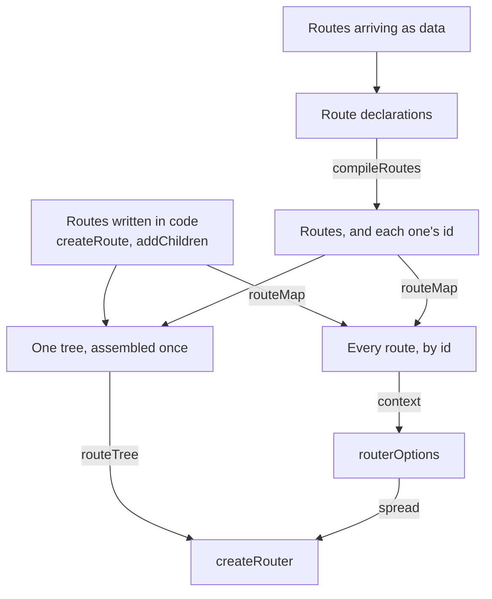

# RFC-0006: Routing: the pieces an application builds a router from

## Summary

We propose `foundations/providers/router`, which publishes the pieces an application builds a router
from rather than a factory that builds one for it. An application calls TanStack Router's own
`createRouter`, spreading the options this design system starts from. An application whose routes
are not all known when it is built compiles the ones that arrive as data into routes it places in
its own tree, and the compiler creates each route under the parent it belongs to rather than
grafting into a tree that already exists. Every route is named, however it arrived, and a page links
to another by reference rather than by path. A route whose condition fails is not found rather than
refused. A screen maps to a route, and the route decides the whole screen.

## Motivation

### The requirements

`examples/app-tanstack` builds a router over two routes by calling `createRouter` directly, and
shares nothing with any other application. That is the routing in this repository.

Its second route, `/reports`, mounts a module another deployment exposes. The host fixes that
address at build time because the other deployment has no way to state where its pages belong, while
`federation.host` already names its remotes at build time and reads where they are deployed from a
document fetched at run time. The address is the last part still hardcoded, and it is hardcoded in
the wrong application.

An application whose routes are known when it is built writes them in code and wants the library's
typing over them. An application whose routes are not all known when it is built has to draw the
rest when they arrive, and no typegen reads a route that does not exist yet. One foundation has to
answer both.

We set five requirements:

- An application keeps the library's typed params and typed search over the routes it wrote itself.
- An application draws routes that arrive as data, in the same URL space as its own.
- A page reaches another page without knowing the path, because an application assembled from parts
  has no path any one part can write down.
- Two routers in one process answer their own routes, which is what a server rendering two requests
  needs.
- Both shapes render on a server.

### Why this layer

The routing rules belong in a foundation rather than in each application. Three things decide it.

Whoever reads routes at run time and whoever draws them have to agree on what a route arriving as
data looks like, and neither is above the other. The declaration type, the compiler that reads it
and the map a link resolves through are the agreement, so both depend on them rather than on each
other.

The defaults are a design system decision. Preloading on intent, leaving freshness to the query
client, and restoring scroll position are the same three answers for every application here, and an
application that states them itself states them differently.

Nothing in this proposal is a router. The library builds one from options and a tree, and this
package publishes both.

### Prior art

We read two routers and one specification, all published.

TanStack Router 1.170.34 types params, search and links from one declared router type, and takes a
Standard Schema validator for search, which is the same mechanism a form's fields are read through.
Its `RouterOptions` states forty-eight members. Its `Outlet` takes no props, so a matched route
draws one page and not several.

React Router 8.4.0 discovers routes lazily through `patchRoutesOnNavigation`, which runs when a path
fails to match. Its eager counterpart, `router.patchRoutes(routeId, children)`, is marked `@private`
and `PRIVATE - DO NOT USE` in the published types and is absent from the public entry. Its typegen
reads a `routes.ts` configuration, which a route arriving at run time is beyond.

Standard Schema states one surface a validator implements, which lets a route carry a search
validator from any library implementing it without this package depending on one.

## Detailed design

### The shape



### The options an application spreads

`RouterOptions` states forty-eight members. A factory wrapping `createRouter` exposes the ones it
thought of and hides the rest, and every library release adds another somebody has to plumb through.
So this package answers an object and the application calls the library.

```ts
/**
 * The one member this package expects a router's context to carry.
 *
 * @remarks
 *   A component resolves an id through the router's own context rather than through a provider of
 *   this package's own, so an application mounts nothing extra to make a link by id work.
 */
export interface RoutesContext {
  /**
   * Every id anything may link to, against the route that answers it.
   */
  readonly routes?: RouteMap | undefined;
}

/**
 * The options a caller spreads into `createRouter`.
 */
export type AppRouterOptions<Context extends object> = {
  /**
   * What reaches every loader and every route component.
   */
  readonly context: Context;
} & typeof routerDefaults;

/**
 * States the options every router in this design system starts from.
 *
 * @param context - What reaches every loader, holding the route map where a caller compiled
 *   declarations.
 * @returns The options, to spread into `createRouter` before the caller's own.
 */
export function routerOptions<Context extends object>(context: Context): AppRouterOptions<Context>;

/**
 * The options every application's router starts from.
 */
export const routerDefaults = {
  defaultPreload: "intent",
  defaultPreloadStaleTime: 0,
  scrollRestoration: true,
} as const;
```

A route preloads on intent, which is when the pointer rests on a link or the link takes focus. What
was preloaded is never fresh on its own, because the query client decides freshness for everything
it loads, and a router with a staleness of its own answers from a copy the client has replaced.
Scroll position is restored on the way back.

An application writing its own routes uses the library and nothing else:

```tsx
const root = createAppRootRoute()();
const invoices = createRoute({ getParentRoute: () => root, path: "/invoices" });
const invoice = createRoute({
  getParentRoute: () => invoices,
  path: "$id",
  validateSearch: z.object({ tab: z.enum(["lines", "history"]).default("lines") }),
});

export const routeTree = root.addChildren([invoices.addChildren([invoice])]);

const router = createRouter({ ...routerOptions({}), basepath: "/admin", routeTree });
```

`useParams` types `id`, `useSearch` types `tab`, and `<Link to="/invoices/$id" params={{ id }} />`
is checked. `createAppRootRoute` is `createRootRouteWithContext` over the context the other pieces
expect, so a mismatch is reported at the root rather than at `createRouter`.

### A declaration

A declaration is a route stated as data. Whatever read it, whether a document fetched at boot, a
remote's own exports or a configuration service, turns what it read into this shape, and the
compiler takes it from there.

```ts
/**
 * One route stated as data, in the form the compiler takes.
 *
 * @remarks
 *   The condition is generic because this package cannot read a session and does not know the
 *   language conditions are written in. A caller states its own and supplies the evaluator.
 */
export interface RouteDeclaration<Condition = unknown> {
  /** Draws the page, either directly or loaded on first navigation. */
  readonly component: FunctionComponent | LazyPage;

  /** The id anything refers to it by, which resolves to a path through the map. */
  readonly id: string;

  /** The layouts it is drawn in, outermost first. Drawn bare where it names none. */
  readonly layout?: readonly string[] | undefined;

  /** Passed to each layout untouched, for whatever the layout reads. */
  readonly layoutOptions?: Readonly<Record<string, unknown>> | undefined;

  /** The menu entry a menu reads, which the compiler writes onto the route without reading. */
  readonly navigation?: unknown;

  /** The pane it is drawn in, which this package refuses because a screen maps to a route. */
  readonly outlet?: string | undefined;

  /** Another declaration it nests under, by id. The compiler's own parent where it names none. */
  readonly parent?: string | undefined;

  /** The path pattern, relative to the parent, in the library's `$id` form. */
  readonly path: string;

  /** A sample of the parameters, which a test opens the page at. */
  readonly sample?: Readonly<Record<string, string>> | undefined;

  /** Reads the search string this route draws with. */
  readonly search?: SearchValidator | undefined;

  /** When it is routed at all. Routed always where it states none. */
  readonly when?: Condition | undefined;
}

/**
 * Loads a page on first navigation, rather than with the bundle that declared it.
 *
 * @remarks
 *   A wrapper rather than a bare function, because a React component is a function too and nothing
 *   at run time separates one from an importer.
 */
export interface LazyPage {
  readonly load: () => Promise<PageModule>;
}
```

`search` is stated structurally as a Standard Schema surface rather than by the library's own type
name, so a declaration carries a validator from any library implementing the specification without
this package depending on one.

### The compiler

```ts
/**
 * What one compilation needs beyond the declarations themselves.
 */
export interface CompileOptions<Condition = unknown> {
  /** Draws a page whose own component threw or failed to load, named per declaration. */
  readonly errorComponent?:
    ((declaration: RouteDeclaration<Condition>) => ErrorRouteComponent) | undefined;

  /** Answers whether a route's condition holds. Required where any declaration states one. */
  readonly evaluate?: Evaluate<Condition> | undefined;

  /** The layouts a declaration may name. */
  readonly layouts?: Readonly<Record<string, FunctionComponent<LayoutProps>>> | undefined;

  /** The route every compiled route hangs under, which this compilation never changes. */
  readonly parent: AnyRoute;
}

/**
 * What one compilation answers.
 */
export interface Compiled {
  /** Every declared id, against the route compiled for it. */
  readonly map: RouteMap;

  /** The routes to place in the parent's own `addChildren` call. */
  readonly routes: readonly AnyRoute[];
}

/**
 * Compiles declarations into routes under the parent a caller states.
 *
 * @remarks
 *   Pure with respect to the caller. It creates routes and never mutates the parent, so a second
 *   call answers a second set of routes sharing no object with the first.
 * @throws {@link Error} Where two declarations share an id, where two share a path under one
 *   parent, where one names a parent or a layout nothing provides, where parents form a cycle,
 *   where one states a condition and no evaluator was given, or where one states an outlet.
 */
export function compileRoutes<Condition = unknown>(
  declarations: ReadonlyArray<RouteDeclaration<Condition>>,
  options: CompileOptions<Condition>,
): Compiled;
```

An application builds its tree as a function of the declarations:

```tsx
function buildTree(declarations: readonly RouteDeclaration<Condition>[]) {
  const root = createAppRootRoute()();
  const shell = createRoute({ getParentRoute: () => root, path: "/app" });
  const home = createRoute({ getParentRoute: () => shell, path: "/home" });

  const arrived = compileRoutes(declarations, { evaluate, layouts, parent: shell });

  return {
    map: routeMap({ "app.home": home }, arrived.map),
    tree: root.addChildren([shell.addChildren([home, ...arrived.routes])]),
  };
}
```

Three library behaviours decide that the compiler creates rather than grafts. `addChildren` is
`this.children = children; return this`, which replaces the children and mutates the route it is
called on. A server outside development caches the processed tree in `globalThis.__TSR_CACHE__`,
keyed by tree identity and written only where the cache is undefined. A route's parent comes from
its `getParentRoute` closure rather than from the traversal.

Taken together, a second router built from a mutated tree object answers from the cache and lists
the first router's routes. Measured over three environments, grafting a route named `beta` before
the second router is built:

| `NODE_ENV`    | What the second router listed                              |
| ------------- | ---------------------------------------------------------- |
| unset         | `__root__`, `/app`, `/app/home`, `/app/alpha`              |
| `development` | `__root__`, `/app`, `/app/home`, `/app/alpha`, `/app/beta` |
| `production`  | `__root__`, `/app`, `/app/home`, `/app/alpha`              |

Cloning the spine to avoid the mutation does not rescue it. A reused child keeps pointing at its
original parent, so its id is computed from the wrong one: a reused `home` registered as `/home`
rather than `/app/home`, while matching still worked, which leaves the id and the URL disagreeing.
Creating each route under the parent it belongs to answers two routers their own routes from one
process, measured under `NODE_ENV=production`.

### A path only one route may answer

A pathless layout consumes no path segment, so two routes with the same path under one parent answer
one URL however many layouts stand between them. The library keeps one of them: `routesByPath` is
written only where the path is not already taken.

Measured, two declarations at `/same` under two different layouts compiled to `/app/_one/same` and
`/app/_two/same`, two distinct route ids, and to one entry in `routesByPath`. The same holds across
a compilation boundary: a declared `/settings` beside an application's own `/settings` drawn inside
a pathless layout of its own produced `/app/settings` and `/app/_own/settings`, one of them
unreachable with nothing said.

So the compiler refuses a path another route already answers under the same parent, counting the
caller's own children as well as the ones it compiles. Reading the caller's tree walks through its
pathless routes to whatever they hold, because those are the routes that answer a path at the
parent's level.

### Naming and linking

A path belongs to whoever assembled the application. A page that might be assembled differently
tomorrow has no path it can write down, and an application built from parts it locates at run time
is in the same position as the parts. So every route is named, however it arrived, and a link names
the id.

```ts
/**
 * Points at a route by the id it was declared under, carrying the parameters its path names.
 *
 * @remarks
 *   Stated structurally rather than imported, so whatever produced the declaration can hand back
 *   its own reference type and have it fit. The parameters live in the type alone.
 */
export interface RouteRef<Params extends AnyParams = AnyParams> {
  readonly "~types"?: { readonly params: Params };
  readonly id: string;
}

/** Points at a route, either by a reference or by the bare id one carries. */
export type RouteTarget<Params extends AnyParams = AnyParams> = RouteRef<Params> | string;

/**
 * Merges however many maps and hand-named routes into the one map a link resolves through.
 *
 * @throws {@link Error} Where two parts claim one id.
 */
export function routeMap(
  ...parts: ReadonlyArray<Readonly<Record<string, AnyRoute>> | RouteMap>
): RouteMap;

/**
 * Resolves a reference to a path, with the parameters the path names filled in.
 *
 * @throws {@link Error} Where the map holds no such id, where no router has processed the tree the
 *   route was placed in, or where a parameter the path names is missing.
 */
export function routeHref<Params extends AnyParams>(
  map: RouteMap,
  to: RouteTarget<Params>,
  params?: Params,
): string;

/** Reads the map every route is named in, from the router's own context. */
export function useRouteMap(): RouteMap;

/** Resolves a reference to a path, through the map the router context holds. */
export function useRouteHref<Params extends AnyParams>(
  to: RouteTarget<Params>,
  params?: Params,
): string;

/** Links to a route by reference, taking everything the library's own `Link` takes. */
export function RouteLink<Params extends AnyParams>(props: RouteLinkProps<Params>): ReactNode;
```

The reference carries the parameters in its type, so filling the wrong one is a compile error:

```tsx
const invoice: RouteRef<{ invoice: string }> = { id: "billing/invoice" };

<RouteLink params={{ invoice: "42" }} to={invoice} />;
<RouteLink params={{ id: "42" }} to={invoice} />;
// error TS2353: 'id' does not exist in type '{ invoice: string; }'
```

Each of the three resolvers throws rather than answer a path that is wrong. An unknown id, a
parameter the path names and nobody supplied, and a tree no router has processed all fail where
somebody wrote them, because interpolation otherwise answers a path with a literal `$id` still in it
and a route with no full path yet answers the site root.

`RouteLink` forwards to the library's `Link`, so an active link carries `data-status="active"`,
`aria-current="page"` and a class of `active` without configuration. Matching is by prefix on a
segment boundary, so a link to `/app/invoices` stays marked on `/app/invoices/42` and a link to `/`
is not marked on `/app/invoices`. A resolved path is relative to the route tree and the library adds
the basepath, so a router at `basepath: "/admin"` draws `/admin/app/invoices` for a route compiled
at `/app/invoices`.

### Reading the page a person is on

A compiled route carries its declaration in the library's own `staticData`, which rides on every
match.

```ts
/**
 * What a compiled route remembers of the declaration it came from.
 */
export interface DeclaredRoute {
  readonly id: string;
  readonly navigation?: unknown;
}

/** Reads the declaration a matched route was compiled from, or nothing for a route in code. */
export function declaredOf(match: MatchedRoute): DeclaredRoute | undefined;

/** Reads the declaration of the deepest declared route the page is on. */
export function useDeclaredRoute(): DeclaredRoute | undefined;

/**
 * Reads the parameters of the page being drawn, typed by the reference the caller holds.
 *
 * @throws {@link Error} Where the page being drawn is not the route the reference names.
 */
export function useRouteParams<Params extends AnyParams>(to: RouteRef<Params>): Params;
```

A compiled route is outside the tree the application registered, so the library types its parameters
as a loose record. The reference carries the types, and `useRouteParams` checks at run time that the
page really is the route the reference names before it makes the claim. A menu, a breadcrumb or a
telemetry hook reads the declaration off the match rather than holding a second copy of the list.

Search parameters have no equivalent. A reference carries no search type, so a page reads them with
`useSearch({ strict: false })`.

### A condition that fails

A declaration may state when its route is routed at all. A route whose condition fails is not
routed, so it does not exist, which is a 404 rather than a refusal.

```ts
/**
 * Answers whether a route's condition holds for whoever is asking.
 *
 * @remarks
 *   Answering false makes the route a 404. An evaluator wanting anything else, such as sending an
 *   unauthenticated person to sign in, throws the library's own `redirect` rather than answering.
 */
export type Evaluate<Condition = unknown> = (when: Condition) => boolean;
```

The compiled route's `beforeLoad` throws `notFound()` where the evaluator says no. The condition is
generic and the evaluator is one function the caller supplies, because this package cannot read a
session and has no business stating the language a condition is written in.

A condition decides whether a route is routed, not whether it is named. A route whose condition
fails is still in the tree and still in the map, so a menu drawn from declarations filters them with
the same evaluator the compiler was given. Which entries a person should see is a question about an
application rather than about routing, so this package does not answer it.

### A screen maps to a route

A screen maps to a route and the route decides the whole screen, so a page drawn beside another as a
pane has no route to be. The compiler refuses a declaration that states one, rather than compiling
it as though the field were absent.

The library agrees. `Outlet` is a memoised component over `() => JSX.Element | null` and takes no
props at all, one route matches per level, and two `Outlet` elements in one component draw the same
child twice, measured as `LIST`, `DETAIL`, `DETAIL`.

A detail beside a list needs none of that. The detail is declared as a child of the list, the list
lays out its own content beside `Outlet`, and the pane gets a real URL, the back button and
preloading with it. Measured, a declared detail under a declared list drew both.

### On a server

A browser builds one router for the life of the page, and a server builds one per request. The
library's own server test is `typeof document === "undefined"`.

The tree is built once per declaration set and the router per request. The process cache is keyed by
tree identity and written once, so a tree rebuilt per request sets the cache on the first request
and never hits it again, while a tree built once and never mutated makes the cache correct rather
than dangerous.

```tsx
const { map, tree } = buildTree(await loadDeclarations());

export async function handler(request: Request): Promise<Response> {
  const router = createRouter({ ...routerOptions({ routes: map }), routeTree: tree });

  await router.load();

  return renderRouterToStream({
    children: <RouterServer router={router} />,
    request,
    responseHeaders: new Headers(),
    router,
  });
}
```

`children` is required on `renderRouterToStream`, typed `ReactNode`, and `RouterServer` is what goes
there. An application whose conditions differ per request builds the tree per request instead and
pays one tree processing for it.

### The type an application registers

The library works paths, params and search out from one declared router type:

```ts
declare module "@tanstack/react-router" {
  interface Register {
    router: ReturnType<typeof createRouter<typeof routeTree>>;
  }
}
```

The augmentation names the library, so an application importing everything else from this package
still names it in this one file. The type names `createRouter` rather than anything of ours.

### The boundary

| This foundation                                                 | The application                                     |
| --------------------------------------------------------------- | --------------------------------------------------- |
| `routerDefaults`, `routerOptions`, `createAppRootRoute`         | Reading routes that arrive as data, and naming them |
| `compileRoutes`, `routeMap`                                     | Its own routes, its shell and its layouts           |
| `routeHref`, `useRouteHref`, `useRouteMap`, `RouteLink`         | The evaluator, which alone can read a session       |
| `declaredOf`, `useDeclaredRoute`, `useRouteParams`              | Its telemetry and its error boundary                |
| `RouteDeclaration`, `RouteRef`, `Evaluate`, the layout contract | The call to `createRouter`                          |

The seam is two pure functions and an object to spread. An application hands `compileRoutes` a list
of declarations, places what comes back, and reads nothing of the router except through the
library's own hooks.

## Alternatives considered

### A factory that builds the router

`createAppRouter({ data, layouts, routes, routeTree, under })` builds the router itself, so an
application calls one function and gets a configured router back.

**Why not:** `RouterOptions` states forty-eight members and the factory would expose the handful it
thought of. Reaching `basepath`, `routeMasks`, `trailingSlash`, `defaultSsr`, `rewrite` or
`notFoundMode` then means adding a pass-through for each, and every library release adds more. The
factory also has to reproduce the five type parameters of `CreateRouterFn` or hand `Register.router`
a router over `AnyRoute`, which drops the typing on `useParams`, `useSearch` and `Link`. An object
to spread leaves every option the caller's and the generic the library's.

### Grafting compiled routes into the application's tree

`createAppRouter({ under: shellRoute, routes })` takes the route to hang under and calls
`addChildren` on it, so an application names one place and the package does the rest.

**Why not:** `addChildren` mutates, the processed tree is cached per process by identity, and a
second router built from the mutated tree lists the first router's routes. That failure appears
under `NODE_ENV=production` and not under `development`, so a server answering two requests from one
process routes the second by the first request's tree, and no test written in development catches
it. Creating each route under its parent also lets an application compile twice with two parents,
which one `under` cannot express.

### Linking by typed path

`<Link to="/app/invoices/$id" params={{ id }} />` everywhere, with the library checking the path
against the registered tree.

**Why not:** it holds only for routes an application wrote itself. A path belongs to whoever
assembled the application. A part located at run time is mounted wherever the application put it,
which the part has no way to read and the application may change. Typed params and typed search
survive this proposal, and typed links hold for the routes an application wrote itself.

### A registry of named guards

A declaration states `when: "signed-in"` and the application registers a guard under that name, the
way a source is registered by name.

**Why not:** a name is a second language beside whatever the condition is already written in, and a
declaration naming a guard nobody registered is a failure a plain value does not have. One evaluator
over the condition the declaration carries keeps one language, and keeps this package out of stating
what a condition may say.

### Drawing a declaration in a named pane

A declaration states `outlet: "detail"` and the foundation draws it in a named pane, opened through
the search.

**Why not:** a screen maps to a route and the route decides the whole screen. The library has no
named outlet and no parallel route, so a pane whose content varies independently is not a route
match at all. Honouring it needs a search key declared by this package, a pane renderer and an error
boundary the router does not supply, and a pane page would take its parameters from the search so
nothing that reads a path parameter serves it and `beforeLoad` cannot enforce its condition. That is
a mechanism beside the router rather than part of it.

### React Router

Take React Router and discover routes that arrive at run time through `patchRoutesOnNavigation`.

**Why not:** its typegen reads a `routes.ts` configuration, so an application's own routes are typed
and a route arriving at run time is beyond it either way. Eager addition goes through
`router.patchRoutes`, which the published types mark `@private` and `PRIVATE - DO NOT USE` and keep
out of the public entry. TanStack answers the same case through `update`, a public method, so the
comparison does not turn on lazy discovery. This repository already carries TanStack Router, with an
example built on it.

## Drawbacks

An application writes four lines it would not write against the library alone: the spread, the root
route factory, the map, and the module augmentation. For an application with all its routes in code
the foundation adds three default options and nothing else, and spreading `routerDefaults` into
`createRouter` directly would do.

An application holds the tree-building as a function rather than a module constant, and calls it
once per declaration set. That is a shape somebody has to know about, and nothing in the type system
enforces it. The rule is documented and the failure it prevents appears only in production.

`routeMap` has to be passed to `routerOptions` for any link by id to resolve, and nothing forces it.
Forgetting it throws at render on the first declared link rather than at compose time.

A link by reference is checked only as far as the reference is typed. A bare id string resolves the
same way and gives up the check, and nothing stops a caller writing one.

The compiler refuses six things, and each refusal is a way an application can be stopped at boot:
two ids, two paths under one parent, an absent parent, an absent layout, a parent cycle, and an
outlet. An application reading declarations it does not control has to handle a refusal rather than
assume a compilation succeeds.

A declaration states no loader, so a page that arrived as data fetches inside its component and
`defaultPreload: "intent"` pre-imports the chunk without warming data. That halves the value of a
default this proposal ships.

The package is 12 source files and 98 specification cases. A reader has to hold the declaration
type, the compiler, the map and the reference model to change any of them.

## Open questions

1. Does React component state survive a tree swap through `update`? Matches keep their ids and the
   `Match` components key on them, so state is probably kept, and nothing has measured it. The
   answer decides whether a route arriving while the page runs needs a reload, and whether a changed
   condition can re-route without one.
2. Which package draws the navigation menu? It reads declarations rather than the router, so it
   could be a component package, a foundation, or an application's own shell.
3. Should a route naming parameters refuse a link that omits them? The wrong parameter name is a
   compile error today and a missing one throws at run time. Making it a compile error needs a
   conditional type that also stops a bare-id link passing any parameters at all.

## Unresolved and future work

A loader on a declaration is not proposed here. The context a declared route's loader reads is the
data foundation's shape, and settling it before that exists means changing it after.

A router for a specification is not proposed here. A declaration states `sample` for it, and nothing
consumes it.

Route-level `ssr` and `head` are not proposed here. A declaration cannot opt out of server rendering
or state a title.

## References

| What                                                     | Where                                                           |
| -------------------------------------------------------- | --------------------------------------------------------------- |
| TanStack Router, the version this proposal reads         | https://www.npmjs.com/package/@tanstack/react-router/v/1.170.34 |
| React Router, read in a probe rather than installed here | https://www.npmjs.com/package/react-router/v/8.4.0              |
| Standard Schema, the search validator surface            | https://github.com/standard-schema/standard-schema              |
