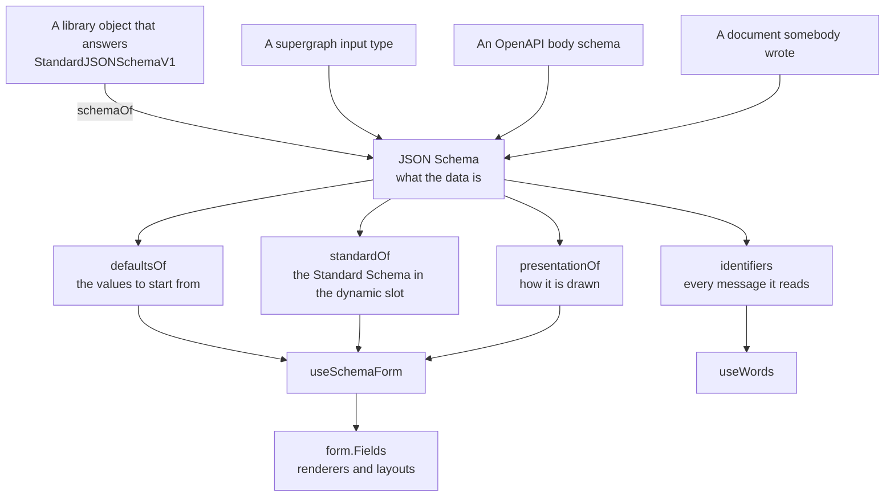

# RFC-0007: Forms: a form built from a schema

## Summary

We propose `foundations/providers/form`, which builds a form from a JSON Schema document. The schema
is the source. The default values, the validator and every message identifier derive from it. How
the form is drawn is data, written in the schema's own `x-form` keyword or beside it, and a
component package draws that data through a ranked registry of renderers. The form itself is
TanStack Form's own. The schema goes in one validator slot as a Standard Schema, every other rule
goes in the slot the library gives it, and a component package binds its components with one call.
An application writes one hook and one element for a form, and nothing forces it to write the fields
by hand.

## Motivation

### The requirements

A product here has forms from four places: a schema we wrote, a supergraph input type, an OpenAPI
body, and a plugin manifest. The last three arrive as documents. Nothing behind them produces a zod
object, and nothing ever will. An application that draws its fields by hand validates them by hand,
states its own words, and writes the same fieldset, wizard and draft code as the application beside
it.

We set six requirements:

- A schema and a submit handler make a form. An application states no label, no message and no rule
  the schema already states.
- A rule the schema cannot state goes where the form library already puts it: a validator on a
  field, or a validator over the whole form.
- Every string a person reads is a message identifier a catalogue answers, and the schema's own text
  is the English until somebody translates it.
- A form a plugin declares as data is drawn by the host without running plugin code.
- A person who refreshes the page finds the form as they left it.
- Nothing forces a hand-written form. Whatever the library offers on a field or a form is reachable
  from the generated one.

### Why this layer

The form rules belong in a foundation rather than in each application or in the component package.
Three things decide it.

Whoever declares a form as data and whoever draws it have to agree on what the data means. Neither
is above the other. The presentation type, the identifier scheme and the engine are the agreement. A
host and a plugin depend on them rather than on each other.

The contexts a bound field and a bound form share are React contexts. A context works only where one
copy of the module exists. A plugin's form and a host's fields have to read the same objects. The
foundation is the one place they come from.

Nothing in this proposal draws an element. The foundation walks a presentation and picks a renderer.
The component package draws every label, control, fieldset and button.

### Prior art

We read the form library, the schema engine and two schema-driven form frameworks, and we measured
the claims this proposal rests on.

TanStack Form 1.33.5 validates with one function or one Standard Schema per slot. `FormValidators`
states twelve members: nine validators and three debounces. A Standard Schema's issues are grouped
by path into `{ form, fields }` and written onto each field's error map as the issue objects are, so
an issue keeps whatever members its producer gave it. `createFormHook` returns `useAppForm`,
`withForm` and `withFieldGroup` over a package's field and form components. `revalidateLogic`
delegates to the default logic and appends the dynamic slot, against its own doc comment, measured
with one marking validator per slot.

`json-schema-library` 11.6.2 compiles a schema once, resolves `if`, `then`, `else` and `allOf`
against a value through `reduceNode`, reports each error with a code and the values the keyword
measured, and keeps an `x-` keyword it does not know. A format the draft does not register passes
every value, and an error code the draft does not register throws from inside the library. AJV
8.20.0 refuses an `x-` keyword in strict mode.

JSON Forms, as its documentation describes it, keeps the form state itself and validates with AJV
over an independent UI tree of JSON pointers. react-jsonschema-form annotates a `uiSchema` shaped
like the data. Neither sits on a form library, and neither groups two fields from different branches
of the data.

i18next 26.4.2's `t` takes a key or a list of keys, tries them in order, returns `defaultValue` for
a missing key and interpolates the default as it interpolates a found message. Its typed signature
keeps a `string | string[]` overload beside the typed keys wherever `defaultValue` is present.

## Detailed design

### The shape



### The schema is the source

A schema library is one way to obtain a schema. It is not the centre. A zod object converts to a
document in one direction only, and three of the four places a form comes from have no zod object
behind them.

`schemaOf` reads a document through, and converts a library object through its own
`~standard.jsonSchema.input({ target: "draft-2020-12" })`. zod 4.6.5 answers that call, measured.
Valibot and arktype were not checked, and the Standard Schema specification publishes no list of
implementers, so a caller finds out by asking for the property.

`defaultsOf` builds the values a form starts from: every property the schema lists, `default`
keywords applied, the values given written over them. A string with no default is `""`, a boolean
`false`, an array `[]`, so every control is controlled from the first render. The engine's library
fills an `enum` with its first choice and a `const` with its value, measured. A select would then
open on a choice nobody made and a consent box would start ticked, so the foundation empties both
where the schema states no `default`.

A generated form has no type. Its values are `Record<string, unknown>`, because the library types
the array paths of a form over `unknown` as `never`. A hand-written form states its type, from a zod
object, from a generated type beside a supergraph fragment, or from code generation beside a
document. The schema does not type the form, and the design does not pretend it does.

### The engine

One engine evaluates every schema on a page. It is `json-schema-library` behind an interface, and
the interface is where every fact about the library's error shapes is kept.

```ts
export interface Engine {
  readonly check: (schema: Schema) => void;
  readonly defaults: (schema: Schema, values?: unknown) => unknown;
  readonly paths: (schema: Schema) => readonly string[];
  readonly resolve: (schema: Schema, values: unknown) => Schema;
  readonly validate: (schema: Schema, value: unknown) => readonly Issue[];
}

export interface Issue {
  readonly keyword: string;
  readonly message: string;
  readonly path: readonly (number | string)[];
  readonly values: Readonly<Record<string, unknown>>;
}

export function createEngine(options?: {
  formats?: readonly Format[];
  keywords?: readonly Keyword[];
}): Engine;
```

A `Format` is a named rule on a string, written as `format: "vat-number"` in any schema. A `Keyword`
takes a parameter, written as `"x-matches": "password"`. It reads the whole value the form is
validating. Both are registered once, in the engine the provider holds. Both apply to every form
under it.

The library throws `ReferenceError` from inside itself for an error code it does not know.
`createEngine` therefore registers a code beside each format. The library passes every value under a
format nobody registered. `check` therefore walks a schema for `format` values and throws where no
`Format` was registered for one. A typo in a supergraph's `format` would otherwise validate nothing
and report success.

The mapping from the library's error to an `Issue`: `min-length-error` becomes the keyword
`minLength`, a `format-*-error` becomes `format`, `#/lines/0/amount` becomes
`["lines", 0, "amount"]`, and the rest of the error's data becomes `values` under the engine's own
names, `minLength`, `length`, `minimum`. A missing required property is reported at the object's
pointer and placed on the property.

Measured on a 52-property schema with `if`, `then` and `else`: `reduceNode` costs 0.215 ms per call,
`validate` 0.003 ms, and AJV's compiled validate 0.0001 ms. `reduceNode` is needed for `resolve`
whichever engine validates, so a second library would buy 0.003 ms per keystroke and cost 580 kB of
runtime code on disk beside 892 kB. We carry one.

### The validators the form runs

`standardOf` wraps a schema as a Standard Schema over the engine, and the form puts it in the
dynamic slot:

```ts
useAppForm({
  ...formDefaults,
  defaultValues: defaultsOf<Signup>(schema),
  validators: { onDynamic: standardOf<Signup>(schema) },
});
```

The library does the mapping. Each issue keeps its `keyword` and `values` beside `message` and
`path`, so a field's errors hold what the frame reads a message identifier from, and no code of this
proposal runs between the schema and the field.

`formDefaults` states `validationLogic: revalidateLogic()` and an `onSubmitInvalid` that moves focus
to the first field with an error. Measured with one marking validator per slot:

| The event                   | Which slots ran                               |
| --------------------------- | --------------------------------------------- |
| A change, before any submit | `onChange`                                    |
| A blur, before any submit   | `onBlur`                                      |
| A submit                    | `onChange`, `onBlur`, `onSubmit`, `onDynamic` |
| A change, after a submit    | `onChange`, `onDynamic`                       |

A rule the schema cannot state is the library's own validator. A rule over one field goes on the
field, in the slot it names, with the debounce it wants, and reads the data layer by closing over
it. A rule over several fields is a form validator returning `{ fields: { end: { keyword } } }`,
which the library puts on `end`. Five facts, each measured, decide where a rule goes:

- One slot holds one function.
- A slot clears its own errors and nobody else's. A field marked by two slots shows both.
- A refused schema stops a field's asynchronous validators, in `FieldApi.js` lines 466 to 495, so a
  request never goes out on a value the schema already rejected.
- A field debounces its own asynchronous slots. A form-level slot has one debounce.
- An asynchronous validator in a synchronous slot throws. `standardOf` is synchronous.

### Presentation is data

The schema states what the data is. A presentation states how it is drawn. Both can be written in
the schema, as `x-` keywords, when the schema is ours, or beside it, as an object, when it is not.
Where both state a field, the form takes the field the call site states.

```ts
export interface Presentation<Values = unknown> {
  readonly fields?: Readonly<Partial<Record<Path<Values>, Field>>> | undefined;
  readonly id: string;
  readonly of?: ReadonlyArray<Member<Values>> | undefined;
  readonly steps?: Steps<Values> | undefined;
}

export type Member<Values = unknown> = Group<Values> | Path<Values>;

export interface Group<Values = unknown> {
  readonly closed?: boolean | undefined;
  readonly columns?: number | undefined;
  readonly direction?: "column" | "row" | undefined;
  readonly legend?: boolean | string | undefined;
  readonly name?: string | undefined;
  readonly of: ReadonlyArray<Member<Values>>;
  readonly repeat?: Path<Values> | undefined;
}

export interface Field {
  readonly control?: string | undefined;
  readonly description?: string | undefined;
  readonly label?: string | undefined;
  readonly options?: Readonly<Record<string, unknown>> | undefined;
  readonly placeholder?: string | undefined;
  readonly span?: number | undefined;
}
```

A group holds its members, so order falls out of the list and a group holds `address.street` beside
`contact.phone` although the data keeps them apart. A group with `repeat` is drawn once per item of
the array it names, with `[]` in its members bound to each index. `steps` holds the kind and the
list, and `of` beside `steps` is refused.

The keywords in a schema: `x-control`, `x-options`, `x-span`, `x-label`, `x-description` and
`x-placeholder` on a property, and `x-form` at the root for `id`, `of` and `steps`. The structure
goes at the root because a group holds fields from anywhere in the data.

A presentation carries no class, no style prop and no length. It carries what a layout recipe
already offers: a direction, a column count, a span, and whether a group starts closed. A plugin
writes a presentation and a host draws it, and a plugin able to write styling could draw anything
anywhere in a host it does not own. `options` is the one hole, and a renderer closes it by parsing
`options` as it would a prop from a stranger.

Three absences are told apart. A field the schema states and no member draws is reported by
`unplaced`. A member the resolved schema lacks and the full schema has is skipped, which is how a
conditional form works. A member no branch of the schema can produce is refused by
`validatePresentation` when the form is built, because a typo that drew nothing in silence would be
found when the data came up short.

### Every string is an identifier

No human-readable string is written in a presentation. Each one is a message identifier, derived
from the form's identifier and the path.

| What                            | The identifier                   |
| ------------------------------- | -------------------------------- |
| A field's label                 | `<id>.fields.<path>.label`       |
| A field's help text             | `<id>.fields.<path>.description` |
| A field's placeholder           | `<id>.fields.<path>.placeholder` |
| One choice of an enum           | `<id>.fields.<path>.options.<v>` |
| A group's legend                | `<id>.groups.<name>.legend`      |
| A step's label                  | `<id>.steps.<name>.label`        |
| An action the form offers       | `<id>.actions.<name>`            |
| A failure from a schema keyword | `<id>.errors.<path>.<keyword>`   |
| The same failure, anywhere      | `errors.<keyword>`               |

An index in a path is collapsed to `[]`, so one identifier covers every row of a repeat group and
the row number goes into the values. The fallback is one call:

```ts
translate([own, shared], { defaultValue: issue.message, ...issue.values });
```

The catalogue answers the first key it has. The default is the schema's `title`, the engine's own
message, or the path written out. The translator's signature is i18next's `t`, so an application
hands in its `t` as it is and a specification hands in `translateFrom` over a map. `translateFrom`
and `untranslated` interpolate `{{name}}` as i18next does, so the form examples run without an i18n
library. The foundation imports none.

Every identifier is computable without rendering the form, so `catalogue` lists them with the
schema's English beside each. A translator receives a complete catalogue for a form nobody has
rendered.

### Drawing

`form.Fields` draws a presentation over the form in scope. It resolves the schema against the
values, walks the members, draws a group through the `Group` layout, a repeat group once per item
through `Item`, the steps through `Step`, and every field through the renderer that suits it, inside
the `Cell` layout. A renderer is a field component. It reads its field through the library's context
and draws the frame itself, and the frame is one component in the package that every control
composes.

```ts
export interface Renderer {
  readonly draw: ComponentType<RendererProps>;
  readonly suits: (presentation: Field, schema: Schema) => number | undefined;
}

export const RANK = { constraint: 3, control: 10, format: 2, type: 1 } as const;
```

The highest rank draws. Two renderers at one rank are settled by registration order, and the later
one draws, so an application overrides a package default by registering after it. The package's
renderers go into `createSchemaForm` and the application's into `FormProvider`, in that order.

`Fields` subscribes to the values through the library's `useSelector` with a selector that resolves
the schema and a comparison by the resolved schema's hash. A change to a value that changes no
conditional re-renders nothing above the field. A repeat group subscribes to its item count alone. A
field subscribes to its own value, as the library's own `AppField` does. The resolve costs 0.215 ms
per change, and a re-render of fifty fields would cost more.

The frame shows an error once the field is touched or a submit was attempted. The schema in the
dynamic slot sees the whole value, so a submit marks fields on later steps as well. A field on a
later step is untouched until its step is reached, and its frame shows the error then.

### Conditional forms

A form whose later fields change with an earlier answer is a schema question, and JSON Schema
answers it with `if`, `then` and `else`. The whole schema goes to the validator, which evaluates the
conditional against the whole value. Drawing needs the schema resolved against the answers so far,
which `engine.resolve` does through `reduceNode`. A property declared under `then` is drawn where
the resolved schema has it and skipped where it does not. Nothing here needs a condition grammar of
its own.

A `oneOf` nobody has answered yet reduces to an error, measured. `resolve` then draws the schema
with its `oneOf` removed, which is the properties every branch shares, until an answer picks a
branch.

### The binding

`createFormHook` takes a package's components. A foundation that called it at module scope would
import the component package, and the package imports the foundation for the contexts. So the
foundation publishes a factory, and the package makes one call:

```ts
export const { useAppForm, useSchemaForm, withFieldGroup, withForm } = createSchemaForm({
  fieldComponents: { Checkbox, Number, Select, Text },
  formComponents: { Form, Submit },
  layouts: { Cell, Group, Item, Step },
  renderers,
});
```

`createSchemaForm` calls `createFormHook` over the foundation's contexts with `Fields` added to the
form components, and returns `useSchemaForm` beside the library's own hooks. An application then
writes:

```tsx
const form = useSchemaForm<Signup>({
  fieldOptions: { username: { validators: { onBlurAsync: taken, onBlurAsyncDebounceMs: 300 } } },
  onSubmit: ({ value }) => save(value),
  schema: signup,
  validators: { onSubmit: apart },
});

return (
  <form.AppForm>
    <form.Form>
      <form.Fields />
      <form.Submit />
    </form.Form>
  </form.AppForm>
);
```

`useSchemaForm` reads the schema and the presentation, checks the presentation, keeps the draft,
builds the form over `schemaFormOptions` and the library options the caller gave, and writes the
description to a registry keyed by the form's store. The description holds the schema, the
presentation, the engine, the translator, the layouts, the renderers and the draft. `Fields`,
`useProperty`, `useWords` and `useResolved` read it back, so a select draws the choices the schema
lists and a text box draws a password box where the property states `format: "password"` without
being told.

`UseSchemaFormOptions` extends the library's `FormOptions`, less the defaults and the validators the
schema fills, so `onSubmit` receives `{ value, formApi, meta }` and `listeners`, `onSubmitMeta`,
`canSubmitWhenInvalid` and the rest reach the form as they are. A field's own options go in
`fieldOptions` by the path the presentation writes, typed over the value at that path through the
library's `DeepKeys` and `DeepValue`. Nothing therefore forces a hand-written form. A form written
by hand draws `form.AppField` itself and `<form.Fields of={["vat"]} />` for a field on a condition.

A `withForm` part typed with the schema's `onDynamic` slot accepts a form carrying more validators
and refuses one carrying none, measured with the compiler, so `schemaFormOptions` types a part and
the hook's form satisfies it. The library types the form it gives a form component over a record
with no members, and a form typed over its own values is not assignable to `AnyFormApi`, so the
foundation reads the form through `useAnyForm` and `leaveStep` takes a structural `Steppable`. The
library gives a form component a copy of the form object and a field the object itself, so the
registry keys by the store both share.

### Keeping a form across a refresh

A draft is kept in the settings foundation's `SettingStore`, local storage where an application
states none, under `settingKey(app, "form.<id>")`. The form's own change listener writes it,
debounced by the library's `onChangeDebounceMs`, as JSON holding a hash of the schema, the step and
the values. A draft typed against another schema is dropped rather than applied. A value at a path
the schema marks `format: "password"` or `x-persist: false` is never written, and `defaultsOf` fills
it back in so the control has a value from the first render. The submit handler's return forgets the
draft.

`useSchemaForm({ draft: { app, id?, store? } })` wires all of it. The draft's identifier is the
form's where the scope states none. An edit form makes one from the record's identifier. A draft of
one record then never opens over another. `useDraft` given no options keeps nothing. The hook
therefore calls it on every render.

### Leaving a step

A wizard validates a step before a person leaves it. Tabs do not. A manifest cannot carry a
callback. The foundation therefore decides what the kind means. `leaveStep` marks each mounted
member touched, calls `validateField` once with the cause `submit`, reads the members' validity and
moves focus to the first refused. One call runs every form-level validator once, measured. A call
per member would run the schema and every request once per member. The stepper inside `Fields` calls
`leaveStep` before a wizard moves forward and writes the step into the draft.

### The boundary

| `foundations/providers/form`                                                         | The component package                       |
| ------------------------------------------------------------------------------------ | ------------------------------------------- |
| The contexts, `createSchemaForm`, `useSchemaForm`, `schemaFormOptions`               | One `createSchemaForm` call                 |
| `Fields`, the walk, the resolve, the steps, the repeat groups                        | `Cell`, `Group`, `Item` and `Step`          |
| `FormProvider`, the engine, the registry                                             | The default renderers, given to the factory |
| `useProperty`, `useWords`, `useResolved`, `leaveStep`, `useDraft`                    | The frame, and every field component        |
| `schemaOf`, `defaultsOf`, `standardOf`, `presentationOf`, `identifiers`, `catalogue` | Nothing of i18n                             |

The foundation draws no element. `examples/form-fields` is the reference component package until
`components/forms` exists.

## Alternatives considered

### Adopting JSON Forms

Take the framework, its UI tree, its renderer registry and its AJV validation.

**Why not:** it keeps form state and validation itself, so it replaces TanStack Form rather than
sitting on it. A zod schema reaches it converted and every refinement is lost. The registry model is
right, and this proposal takes it. The dependency is not.

### Annotations shaped like the data

A `uiSchema` mirroring the data schema, as react-jsonschema-form does, with `ui:widget` and
`ui:order` hung off each property.

**Why not:** the shape that keeps it in step with the schema is the shape that limits it. Two fields
from different branches cannot share a fieldset, and there is nowhere to hold a step.

### A zod object as the source

Make a zod object the form's source and read JSON Schema out of it for drawing.

**Why not:** a supergraph input type, an OpenAPI body and a plugin manifest have no zod object
behind them. A zod object still fits: `schemaOf` converts it, and a zod object with a `transform`
goes in one slot as it is.

### Rule types of our own

A `Check` on a field with `at` and `debounce`, an `Across` over several fields, a `Failure` they
return, and a factory that composes them into the library's slots.

**Why not:** the library already does each of those. A rule over one field is a field validator with
its own debounce and `listenTo`. A rule over several is a form validator returning
`{ form, fields }`. A Standard Schema goes in one slot. A Standard Schema receives the value alone,
so `at` cannot be read from inside one, and the library debounces per slot, so `debounce` per check
has no counterpart. Each rule type is a second copy of a library member.

### Literal strings, translated by the caller

`label: "VAT number"` in the presentation, and a caller wraps it.

**Why not:** a caller cannot wrap what a generated form produced, because the strings are inside it.
Derived identifiers mean the ordinary form states nothing and the catalogue is generated rather than
gathered.

### Each renderer drawing its own label

A renderer receives the resolved words and draws label, control, help text and error itself.

**Why not:** twenty renderers would each wire `id`, `aria-describedby`, `aria-invalid` and
`aria-required`, and they would drift. The library gives no ids, so the wiring is ours, and ours
belongs in one frame. A checkbox draws its label inside the control and is the exception.

### A `Fields` closure the hook returns

`useSchemaForm` returns `{ form, Fields }` with `Fields` bound to the form.

**Why not:** a component created in a hook needs a stable identity across renders. A `withForm` part
receives the form and not the closure, so the closure cannot be used inside one. A form component
reads the form from the library's own context and the schema from the registry. It works anywhere
the form does. It is the library's own shape beside `form.Form` and `form.Submit`.

### The binding in the component package

`useSchemaForm` and `Fields` are written in the component package. The package calls
`createFormHook` itself.

**Why not:** every component package would then contain the walk, the resolve, the steps and the
draft wiring. A second package would copy them. A factory in the foundation takes the components and
keeps the machinery in one place. The package still makes one call.

## Drawbacks

A generated form has no type. Its values are `Record<string, unknown>`. A submit handler reads
`value.name` as `unknown`. A form that wants a type states one. The schema and the type can then
drift.

A rule that marks one field from the values of another is written at the form, where the whole value
is read, rather than on the field. A person reading the field does not see the rule there. The
library's `onChangeListenTo` would let the field state the rule. A generated form has no way to
choose which of two fields a cross-field rule belongs to.

The engine costs 892 kB of runtime code on disk. Nobody has measured the bundle, and the measurement
is what would decide whether a form page can afford it.

A typed presentation is not assignable to the untyped one the registry holds, because the compiler
cannot relate `Path<Values>` to `string` across a type parameter. One assertion at that boundary
stands in `described.ts`.

## Open questions

- Does a form page's bundle afford `json-schema-library`? A measurement above what a page can carry
  reopens the engine choice, and AJV is the alternative it would reopen to, behind the same
  `Engine`.
- Where does `Path<Values>` live? The data design measured it and the presentation uses it. One
  copy, in a package both foundations import, would stop the two from drifting.
- Does the settings foundation get a session-storage store? A draft in local storage outlives the
  tab.
- Does a provider re-export the library by name or with a wildcard? A written list is the reason for
  re-exporting under our own name, and a wildcard publishes whatever the library adds next without
  anyone reading it. The three providers here write `export *`. No standard decides it.

## Unresolved and future work

- `provider-i18n` and `vite-plugin-i18n`, which type a catalogue's keys and serve them. The form
  takes a function, so nothing here waits on them.
- `components/forms`, which takes `examples/form-fields` over with recipes once the theme settles.
- Manifest validation for a presentation in the SDK, against `engine.paths` and the keyword table,
  and a plugin's renderers appended to the host's provider on registration.
- A meta-schema for the `x-` keywords, generated from the `Presentation` type once a manifest
  carries a form.
- Typed field options for a path inside a repeat group. `FieldOptionsByPath` writes `[]` as an index
  for the library's `DeepKeys`, and a value type deeper than one array is unmeasured.

## References

- `foundations/providers/form/src/` and `examples/form-fields/src/`, the implementation.
- `examples/form-basic`, `examples/form-rules`, `examples/form-draft` and
  `examples/form-presentation`, one form each.
- `@tanstack/form-core` 1.33.5: `FormApi.d.ts`, `FieldApi.js` lines 466 to 495,
  `ValidationLogic.js`, `standardSchemaValidator.js`, `createFormHook.d.ts`.
- `json-schema-library` 11.6.2 and `ajv` 8.20.0, measured in a probe: `reduceNode` 0.215 ms,
  `validate` 0.003 ms, AJV 0.0001 ms per call on a 52-property schema, 1000 calls each.
- i18next 26.4.2, `dist/esm/i18next.js` lines 802 to 803, 662 to 665 and 718, and
  `typescript/t.d.ts` line 464.
- A `tsc` 7.0.2 probe over `createFormHook`: a `withForm` part typed with `onDynamic` accepts a form
  with more validators and refuses one with none.
