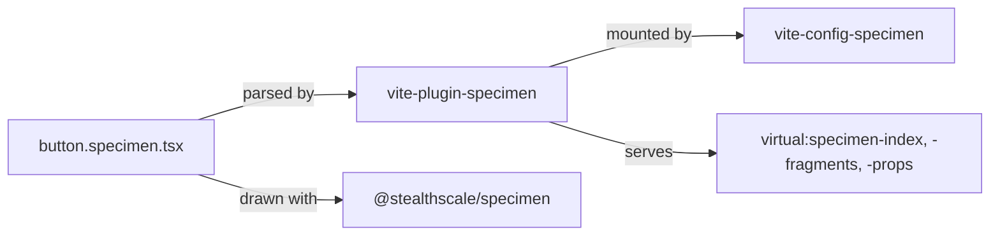

# RFC-0008: Specimens: the page, the index and the props a catalogue draws

## Summary

A specimen is a file beside the component it shows, `<name>.specimen.tsx`. Its default export is a
`specimen()` call with an identifier, a group and a list of scenes. A Vite plugin parses that call
out of the source text and never evaluates the module. It serves `virtual:specimen-index`,
`virtual:specimen-fragments/<id>` and `virtual:specimen-props/<id>`. Classification reads every
declaration behind a property. A recipe file makes it a variant. The component's own package makes
it an option. Everything else is dropped under a count the page shows. `ButtonProps` resolves to
1341 properties and keeps six.

## Motivation

### The requirements

RFC-0004 closed on a line this proposal picks up: "A specimen kit, and a specimen beside every
component, are not proposed here."

A component's axes are written in its recipe. Its options are written in its props type. A reader of
the library sees either one only by opening the file. Writing them into a documentation page by hand
produces a second copy, and the second copy drifts the day an axis is added. The drift is silent.
RFC-0004 gives `Text` five axes and 20 values. Fifteen packages at that density is documentation
nobody keeps true.

The requirements:

- The catalogue lists every page before it loads one. Opening it costs a single module instead of
  every component in the library.
- A page draws the axes a theme moves and the options a caller sets, taken from the types. The table
  cannot disagree with the component.
- A scene is shown as source a reader pastes into an application. That source compiles without the
  rest of the file.
- A specimen does not count towards a package's coverage and does not fail a source check. A library
  at 100% stays there.

### Why this layer

An application that does not show a catalogue includes none of this. The plugin runs at build time
over source text and a compiler. The config packages add layers to a configuration that already
exists, and the component package draws with `Stack` and `Text` the library already publishes.

The compiler is what knows which package a file belongs to, and the plugin already keeps one open
for the page on screen. The props reader is therefore part of the plugin. A separate package would
start a second compiler for the same question.

## Detailed design

### The specimen file

A specimen is a file in the component's directory, named after the component. `Scene` and `Specimen`
are the two types. `specimen()` and `scene()` are identity functions that type an object literal at
the call site.

```tsx
// components/actions/src/button/button.specimen.tsx
export const elevation: Scene = {
  about: "A lifted button rises under a pointer and drops towards the page under a press.",
  draw: () => (
    <Matrix direction="row" knob="elevation" of={LIFTED}>
      {(lift) => <Button elevation={lift}>Publish</Button>}
    </Matrix>
  ),
  title: "Elevation",
};

export default specimen({
  about: "The element a person presses, and the square that holds one glyph.",
  group: "Actions",
  id: "actions/button",
  scenes: [looks, sizes, statuses, elevation, square, states],
});
```

`draw` is a component and not a node. A scene that keeps state declares its hooks in its own render.
Called as a function, those hooks would belong to whatever drew the scene.

Each scene is exported under its own name as well as listed. The export is what the fragment reader
finds the declaration by, and it costs the author nothing.

`Matrix` draws one captioned cell per value of an axis and takes the values from the theme:

```tsx
<Matrix direction="row" knob="size" of={SCALE}>
```

`SCALE`, `LOOKS`, `LIFTED` and `STATUSES` are exports of `@stealthscale/theme/authoring`. A scene
that types its values out by hand is a third copy of the vocabulary and goes stale the same way a
hand-written table does.

### The index

```ts
import { pages } from "virtual:specimen-index";
```

One entry per file, sorted by path. An entry has the metadata, the name of the package the file
belongs to, and four loaders: `load` for the scenes, `source` for the file's text, `fragments` for
the scenes as source, and `props` where the repository reads them. Each loader is a dynamic import,
so the bundler emits one chunk per specimen and a catalogue of two hundred pages loads one.

`id`, `group`, `title` and `about` are read as source text by Vite's own parser, and the module
never runs. Evaluating it would cost the whole library before a reader clicked anything, because a
specimen imports its component and the component imports the theme.

The index refuses the second of two files declaring one identifier and points at the first. The
second page would otherwise be unreachable.

A file that matched a pattern but does not declare a page is listed under its path, with the reason
as its opening and a loader that rejects with the same reason. A build throws instead and names
every unreadable file in one error. Failing a dev server on one bad file costs the reader the other
nineteen pages.

### The fragments

```ts
const { fragments } = await import("virtual:specimen-fragments/data/badge");
```

A fragment is the scene's declaration, every top-level declaration it references, and the import
specifiers those use. An import that nothing in the snippet reaches is cut.

The Elevation scene above reduces to `Matrix`, `Scene`, `LIFTED` and `Button`. It excludes `Icon`,
`IconButton`, `SCALE`, `LOOKS`, `STATUSES`, `CHECK`, `VARIANTS`, `SHOWN` and `PRESSED`. The
alternative is showing the reader all 95 lines of the file to explain a four-line example.

### The props

```ts
const { dropped, parts, shapes } = await import("virtual:specimen-props/data/badge");
```

A part is a `*Props` type exported from the specimen's own package by a module the specimen imports.
The button specimen imports `Button` and `IconButton`, so its page has two parts.

`shapes` maps each named type the props refer to onto its members, keyed by the package and the
name. A union written under a name is recorded as its options, so `size: Scale` reads as its eight
steps. A type with more members than the cap is named and not listed. A type from TypeScript's own
libraries is skipped, found through the compiler's metadata for the file and not by matching its
path.

`props` is off by default. The catalogue then indexes without loading a compiler, and an
installation without TypeScript works. Stated, the first page opened starts a compiler and the pages
after it reuse it.

### The classification

Classification reads every declaration behind a property:

| Where a property is declared   | What it is                               |
| ------------------------------ | ---------------------------------------- |
| A `recipe.ts` or `*.recipe.ts` | A variant, the axis a theme moves        |
| The component's own package    | An option                                |
| Anywhere else                  | Dropped, and counted under `dropped`     |
| Nowhere at all                 | A styling condition, dropped and counted |

Both tests use the compiler's own answer for which package a file belongs to, so the classification
works without a path written in this repository.

Measured on `components/actions/src/button/button.specimen.tsx` under TypeScript 7.0.2:

| Part              | Resolves to | Conditions | Elsewhere | Kept |
| ----------------- | ----------- | ---------- | --------- | ---- |
| `ButtonProps`     | 1341        | 284        | 1051      | 6    |
| `IconButtonProps` | 1341        | 284        | 1049      | 8    |

The 284 have no declaration anywhere. A mapped type over the styling conditions resolves to them,
`_hover`, `_focus` and the rest, and the checker reports each with an empty declaration list. No
pattern has to name the conditions. A property nobody declared is not a property a table draws.

The 1051 are the generated style props, React's own attributes, and the factory's `as` and
`unstyled`. Each is declared outside the package and outside any recipe. `as` and `unstyled` are
declared in the theme foundation, so the props every component shares fall out of the same test.

`ButtonProps` keeps `effect`, `elevation`, `shape`, `size`, `status` and `variant`, each declared
once in `components/actions/src/button/recipe.ts`. `IconButtonProps` keeps those six plus
`aria-label` and `aria-labelledby`.

Taking the first declaration and discarding the rest loses the last two. The declarations, in the
order the checker returns them:

| Property                          | Declarations, in order                                  |
| --------------------------------- | ------------------------------------------------------- |
| `ButtonProps.aria-label`          | `@types/react`                                          |
| `IconButtonProps.aria-label`      | `@types/react`, `button/icon-button.ts`, `@types/react` |
| `IconButtonProps.aria-labelledby` | `@types/react`, `@types/react`, `button/icon-button.ts` |

`declarations[0]` is React's on both, so both drop as foreign. The page for the one component in the
library that requires an accessible name then documents no way to set it. The plain button has a
single declaration and drops correctly, which is the behaviour the rule has to preserve while it
fixes the icon button.

No variant in the repository is shadowed by a style prop today. That holds until the list is
written. RFC-0004 gives `List` a `gap` axis over the `gap.*` scale, and `gap` is already a generated
style prop at `foundations/theme/generated/types/system.d.mts:1247`. Under a first-declaration rule,
whether the list's `gap` axis reaches its own page depends on which intersection member the checker
walked first.

`dropped` is served, not hidden. A reader who sees 6 rows and no account of the other 1335 has
nothing to calibrate against.

### The packages



`@stealthscale/vite-plugin-specimen` is the plugin. It is named `stealth:specimens` and peers on
`vite` and `@stealthscale/vite-plugin-base`. `typescript` is an optional peer, loaded on the first
page that reads props.

`@stealthscale/vite-config-specimen` has three entry points, because three configurations read
different things:

- `catalogue(options)` for the application showing the pages. It contributes `specimen.indexed`,
  which appends the plugin, and `specimen.crawled`, which lists every specimen as an entry for the
  dependency scan. A specimen is reached through a dynamic import the scan does not follow. Without
  the entries, the first page a reader opens re-optimises and reloads the catalogue.
- `layers()` for a package that holds specimens. It stops them counting towards the package's
  coverage.
- `workspace()` for the root. It repeats the coverage exclusion and adds the lint departures. The
  root run counts every package's files and reads the root's configuration alone, so a departure
  stated in a package is one the root run never sees.

`@stealthscale/specimen` publishes `specimen()`, `scene()`, `Matrix`, `Axis`, `nameOf` and
`captionOf`. It states no recipe and no theme. `Matrix` is `Stack` and `Text` from the library, so a
theme that moves the library moves the catalogue with it, and a theme extends the library's own
recipes instead of a set kept here.

`@stealthscale/testing-config` treats `*.specimen.tsx` the way it already treats a spec or a
fixture. A specimen does not need a spec beside it.

### The lint departures

A specimen breaks four house rules on purpose. `workspace()` states each one against
`**/*.specimen.tsx` alone:

- A default export, which every other file in the repository is forbidden. The default export is the
  contract the plugin parses.
- An undocumented export. A scene's `about` is the documentation, and the catalogue reads it rather
  than a linter.
- More than one component in a file. A page is six scenes.
- A component exported beside a value. `looks` is both.

ADR-0003 already puts lint and format at the root, and these follow it.

## Alternatives considered

### Storybook

Use the tool the industry uses. It reads props and shows source. Its addons cover accessibility and
viewports, and a decade of engineers already know it.

**Why not:** it is a second application with its own build, its own bundler configuration and its
own version of the framework. This repository's design is one configuration grammar that every
application extends, and a catalogue on the layer kernel inherits the tier, the theme plugin and the
conformance suite for 1300 lines. The props reader is the part worth owning either way. A recipe
file means an axis here, and no general tool knows that.

### Evaluate the module and read the export

Import the specimen and read the object. There is no parser to write and no source text to slice,
and the metadata is whatever the module says it is.

**Why not:** the listing then costs every component in the library before a reader clicks anything.
Evaluation also runs arbitrary code during an index build, and one specimen that throws on import
takes the catalogue with it.

### Read the props off the component at run time

Render the component and record what it accepted, or read `Component.propTypes`.

**Why not:** a component built by the factory reports two props at run time and neither is its own.
The exported `*Props` type is what knows, and resolving it takes a checker.

### Take the first declaration and filter the rest with patterns

Classify on `declarations[0]` and remove the noise with lists of regular expressions covering the
styling conditions, the generated style props, the framework's attributes and the props every
component shares. It asks nothing of the compiler beyond the property list.

**Why not:** four lists is four things to maintain against a generated file that changes with every
compiler release. The rule also drops the accessible name on `IconButtonProps` today, measured
above. Reading every declaration removes all four lists and the defect together.

### A catalogue viewer package in this repository

Publish the application that draws the pages, so a consumer installs a catalogue instead of writing
one.

**Why not:** a viewer is an application plus an opinion about navigation, routing, layout and
search, none of which this proposal has measured. The contract is the virtual modules. The viewer is
deferred to the documentation space.

### Messages rather than props for the catalogue's words

Give the catalogue's own words identifiers and resolve them through the i18n foundation, the way an
application does.

**Why not:** the audience is the people building the library. A prop with an English default is one
word to override and no message catalogue to keep, and the pages a consumer writes are already in
whatever language they wrote them in.

### Authoring furniture in the specimen package

Publish `Box`, `Row`, `Column` and `Text` for scenes to lay themselves out with.

**Why not:** four components that duplicate `Stack` and `Text`. Each one needs a recipe, a spec, a
place in the theme and a reason to exist. A scene needing a row writes `Stack`, which is what a
consumer would write.

## Drawbacks

- **A compiler in the dev server.** Reading props starts a TypeScript process and keeps it open. A
  change to any typed file under a searched directory restarts it, because a snapshot serves the
  text it first read whatever it is told about a change.
- **The unstable API.** `typescript/unstable/sync` is unstable by name, and a 7.x release may move
  it. The reader is behind one interface, `Compiler`, so a move costs one file.
- **A merged doc comment.** A property declared in more than one place gets every one of those
  comments. Preferring one by source was tried and dropped as too fragile to justify the branch.
- **The coverage exclusion is stated twice.** `layers()` states it for a package and `workspace()`
  states it again for the root, because the root run reads the root's configuration alone.
- **No consumer in this repository.** `catalogue()` is uncalled. The virtual modules are covered by
  the plugin's 218 specs and by hand, and not by an application CI runs.
- **A scene has to be exported.** A scene written inline in `scenes` draws correctly and produces an
  empty fragment.

## Answered questions

- **How many properties does a button resolve to?** 1341, of which six are its own. Measured through
  the reader against `components/actions/src/button/button.specimen.tsx`.
- **Do the styling conditions need a pattern to find them?** No. All 284 arrive with an empty
  declaration list.
- **Does a first-declaration rule lose anything here?** Yes. `IconButtonProps.aria-label` and
  `IconButtonProps.aria-labelledby` each have three declarations with React's first.
- **Is the shadowed-variant case hypothetical?** Only until the list is written. RFC-0004 gives
  `List` a `gap` axis, and `gap` is a generated style prop today.
- **Can the fragment reader cut a scene out of a real file?** Yes. The button's Elevation scene
  reduces to `Matrix`, `Scene`, `LIFTED` and `Button`.
- **Does the catalogue need the module to run?** No. `id`, `group`, `title` and `about` come from
  the source text.

## Unresolved and future work

- The documentation space that draws the pages is not proposed here. It reads the virtual modules
  and decides navigation, routing and layout.
- A specimen beside every component follows the viewer. The button is the only specimen, and writing
  twenty against an unproven viewer is work done twice.
- A check that a component with axes has a scene per axis is not proposed here.
- `shapes` records a union's options and a type's members. A recursive type is listed once and a
  type past the depth is named. Both limits are unmeasured against a real page.
- ADR-0036, ADR-0037 and ADR-0038 record the decisions this proposal produces: parsing instead of
  evaluating, classifying on every declaration, and the virtual module contract.

## References

| What                                                       | Where                                                       |
| ---------------------------------------------------------- | ----------------------------------------------------------- |
| The form a specimen follows on from                        | `docs/rfc/0004-the-form-of-a-component.md`, line 524        |
| The `List` `gap` axis this design has to survive           | `docs/rfc/0004-the-form-of-a-component.md`, line 303        |
| `gap` as a generated style prop                            | `foundations/theme/generated/types/system.d.mts`, line 1247 |
| The synchronous compiler API, at 7.0.2                     | `typescript/unstable/sync`                                  |
| The page every measurement in this proposal was taken from | `components/actions/src/button/button.specimen.tsx`         |
| The reader those measurements were taken through           | `packages/vite-plugin-specimen/src/anatomy/`                |
